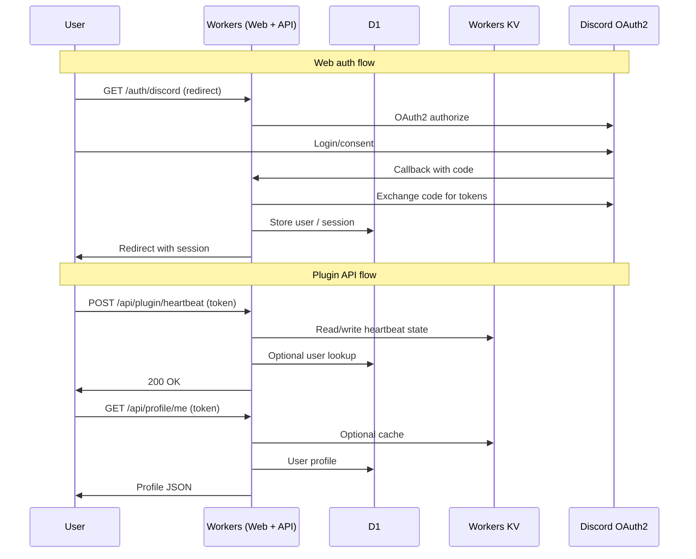

# Data Flow Diagram

Request/response patterns: web auth flow (GET /auth/discord, OAuth2, callback, session); plugin API flow (POST /api/plugin/heartbeat, GET /api/profile/me); Workers, D1, KV, Discord OAuth2. See [architecture README](../README.md).

Source: [data-flow.mmd](data-flow.mmd)

