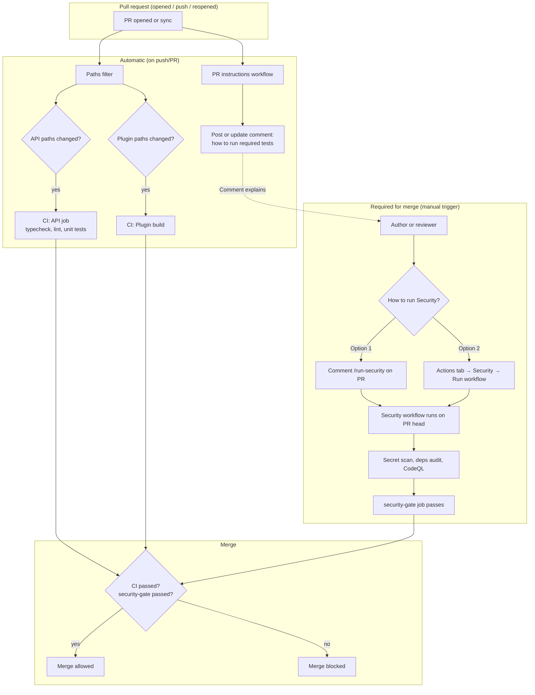

# PR and testing flow

Flow of a pull request and how tests run: automatic CI (path-filtered), manual Security trigger, and merge gate. See [testing harness](../../guides/testing-harness.md).

**Source:** [pr-testing-flow.mmd](pr-testing-flow.mmd)

