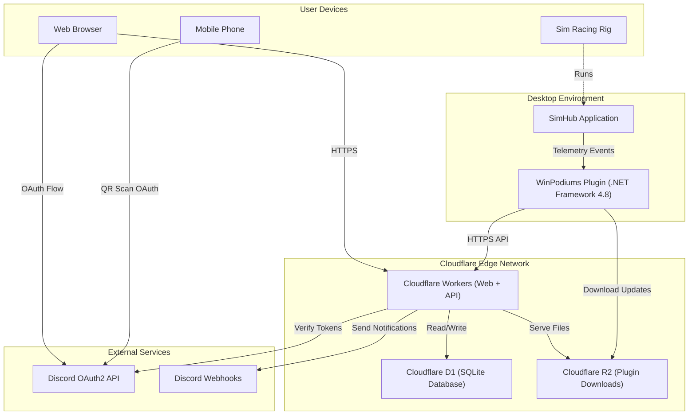

# System Overview Diagram

Component relationships: User Devices, Desktop (SimHub + Plugin), Cloudflare Edge (Workers, D1, R2), External Services (Discord OAuth, Webhooks). See [high-level-design](../high-level-design.md) and [architecture README](../README.md).

Source: [system-overview.mmd](system-overview.mmd)

