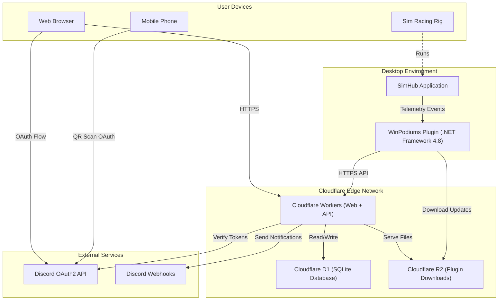
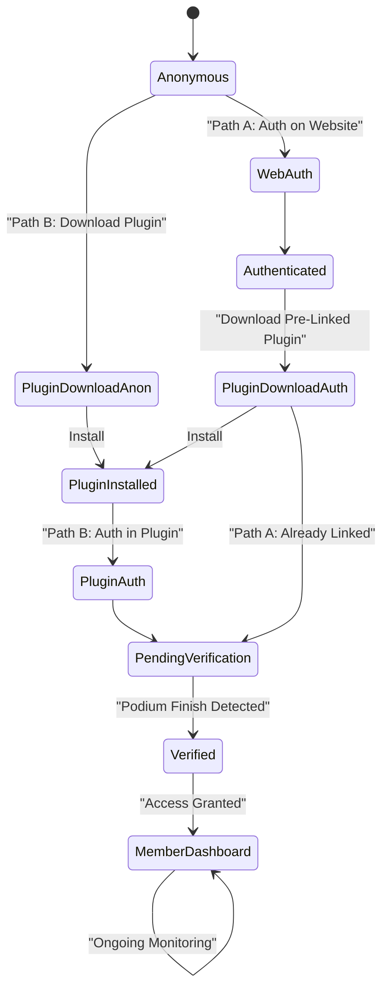

# High-Level Design: WinPodiums

**Version**: 1.0  
**Last Updated**: 2026-01-31  
**Status**: Draft

## 1. Executive Summary

### Business Context
WinPodiums is a merit-based luxury community for elite sim racers. Members gain access not through static applications, but through **active verification** of racing skill via real-time telemetry monitoring.

### Core Value Proposition
- **Active Merit Verification**: SimHub plugin monitors races and automatically verifies podium finishes (P1/P2/P3)
- **Dignified Recognition**: Transform digital achievement into a ceremonial, luxury brand experience
- **Hybrid Entry Paths**: Support both ceremonial web-first flow and exploratory plugin-first flow

### Brand Philosophy
"The Podium Invitation" — Every interaction reinforces earned access through racing merit, not self-reported achievements.

### Success Metrics
- **Technical**: >90% plugin install success, <1% false-positive verification, <200ms API latency (p95)
- **Business**: >60% activation rate, >70% 30-day retention, >8/10 luxury brand perception

## 2. System Overview

### Architecture Pattern
**Microservices with event-driven communication**, deployed on Cloudflare Edge Network for global low-latency access.

### Core Components

### Component Responsibilities

| Component | Responsibility | Technology | Scaling |
|-----------|---------------|------------|---------|
| Web Frontend | Luxury UI, onboarding, dashboard | Cloudflare Workers (SSR) | Edge CDN, auto-scaling |
| API Layer | Auth, telemetry validation, anti-cheat | Cloudflare Workers | Edge compute, <50ms limit |
| SimHub Plugin | Telemetry monitoring, local auth UI | C#/.NET Framework 4.8 WPF | Client-side, no scaling needed |
| Database | User profiles, race results, auth sessions | Cloudflare D1 (SQLite) | Edge replication, eventual consistency |
| Storage | Plugin installers, static assets | Cloudflare R2 | Global CDN |
| Identity | Authentication, token issuance | Discord OAuth2 API | External (Discord infrastructure) |

## 3. User Journeys & Authentication

### Primary Personas
- **The Aspirant**: Unverified user seeking access
- **The Victor**: Verified member with proven podium finishes
- **The Champion**: High-engagement member with extensive history

### Hybrid Authentication Architecture

**Path A: Web-First (Ceremonial Entry)**
- **Best for**: Returning members, users who value the "invitation" ceremony
- **Flow**: Website → Discord Auth → Download Pre-Linked Plugin → Race → Auto-Verify
- **UX**: High ceremony, seamless plugin setup, authenticated from start

**Path B: Plugin-First (Try-Before-Commit)**
- **Best for**: New users, explorers wanting to test before authenticating
- **Flow**: Website → Anonymous Download → Install → Race → Auth in Plugin → Verify
- **UX**: Low friction entry, flexible trial period, auth when ready

### State Machine

### Plugin Authentication Methods
1. **Browser Launch**: Opens system browser for Discord OAuth (desktop-friendly)
2. **QR Code**: Display QR in plugin, scan with phone (modern, mobile-friendly)
3. **Manual Token**: Copy token from website into plugin (fallback for troubleshooting)

See [Discord Integration LLD](../design/integrations/discord-integration.md) for detailed authentication flows.

## 4. Technology Stack

### Frontend
- **Framework**: Cloudflare Workers with SSR (originally planned as Pages, but Workers needed for dynamic functionality)
- **UI Library**: React/Solid.js (TBD based on Workers compatibility)
- **Styling**: Custom design system (see [Visual Design System](../brand/design-system.md))
- **State**: Context API or lightweight library

### Backend
- **Runtime**: Cloudflare Workers (JavaScript/TypeScript, V8 isolates)
- **API**: RESTful HTTP endpoints (see [API Documentation](../api/))
- **Constraints**: 50ms CPU time limit per request
- **Caching**: Workers KV for user profiles (reduces D1 reads by 90%)
- **Cost**: Free tier (100K requests/day) for MVP; $5/month paid plan for scale

### Desktop Application
- **Language**: C# / .NET Framework 4.8 (SimHub SDK requirement)
- **UI**: WPF with luxury design system
- **Dependencies**: SimHub SDK, Discord OAuth libraries
- **Platform**: Windows 10/11

### Data Layer
- **Database**: Cloudflare D1 (SQLite-based, edge-replicated)
- **Cache**: Workers KV (key-value cache for user profiles, reduces D1 reads)
- **Storage**: Cloudflare R2 (S3-compatible object storage, plugin downloads, archived data)
- **Encryption**: Workers Secrets for tokens, DPAPI for plugin storage
- **Cost**: Free tier (5M reads/day, 100K writes/day, 5GB storage) for MVP

### External Services
- **Identity**: Discord OAuth2 (Authorization Code + PKCE)
- **Community**: Discord webhooks and bot (Phase 3)

## 5. Data Architecture

### Core Entities
- **User**: Discord-linked identity, verification state, podium count
- **RaceResult**: Verified podium finishes with telemetry snapshot
- **AuthToken**: OAuth2 tokens (access, refresh) encrypted at rest
- **QRAuthSession**: Temporary sessions for QR code authentication
- **ManualToken**: One-time tokens for manual auth flow
- **PluginInstallation**: Plugin version, health status, last heartbeat

See [Database Schema LLD](../design/data-models/database-schema.md) for detailed entity relationships and indexes.

## 6. Security Architecture

### Authentication
- **Primary Identity**: Discord OAuth2 as single source of truth
- **Flow**: Authorization Code + PKCE (no client secrets in desktop app)
- **Token Storage**: DPAPI (plugin), Workers Secrets + AES-256 (API)
- **Session Management**: HTTP-only, Secure, SameSite cookies for web

### Telemetry Verification
- **Cryptographic**: HMAC-SHA256 signatures on all race result packets
- **Anti-Replay**: Nonce + timestamp validation, 5-minute drift tolerance
- **Rate Limiting**: Max 10 podium submissions per user per day
- **Validation Rules**:
  - Session legitimacy (online multiplayer, minimum 4 participants)
  - Temporal consistency (submission within 5 minutes of race end)
  - Statistical plausibility (lap times within 107% of world record, reasonable incident count)

### Privacy & Compliance
- **Data Minimization**: Only Discord ID, username, avatar (no email, no real name)
- **GDPR**: Right to access, erasure, portability
- **Encryption**: At-rest (D1 default, Workers Secrets), in-transit (TLS 1.3)

See [Security & Anti-Cheat LLD](../design/security-anticheat.md) for detailed security measures and threat mitigation.

## 7. Integration Architecture

### SimHub ↔ API
1. Plugin hooks SimHub `SessionEnd` events
2. Filters for podium finishes (Position ≤ 3) in competitive sessions
3. Builds encrypted telemetry payload with HMAC signature
4. POST to `/api/plugin/verify`
5. API validates signature, runs anti-cheat checks
6. Updates user verification state in D1
7. Returns success/failure to plugin

### Discord ↔ System
1. **Web Auth**: Standard OAuth2 redirect flow
2. **Plugin Browser Auth**: PKCE flow with loopback listener
3. **Plugin QR Auth**: Plugin polls API, mobile completes OAuth2, API bridges token
4. **Plugin Manual Token**: User gets one-time token from website, enters in plugin

See [Integration Flows](../design/integrations/) for detailed sequence diagrams.

## 8. Deployment Strategy

### Hosting
- **Web/API**: Cloudflare Workers (edge compute, auto-scaling)
- **Database**: Cloudflare D1 (edge-replicated SQLite)
- **Cache**: Workers KV (reduces D1 reads, improves performance)
- **Storage**: Cloudflare R2 (global CDN distribution, plugin downloads, archived data)
- **Background Jobs**: Cloudflare Cron Triggers (scheduled cleanup, free)
- **Plugin**: Distributed via R2, installed locally by users
- **Cost**: $0/month for MVP (free tier), $5/month for Phase 3 (100K users)

### Environments
- **Local**: Wrangler dev server with `.dev.vars` for secrets
- **Staging**: `staging.winpodiums.com` branch deployment
- **Production**: `winpodiums.com` with protected main branch

### CI/CD
- GitHub Actions for automated testing
- Automated deployment on merge to `main` (Workers)
- Plugin releases via GitHub Releases + R2 upload

See [Deployment Guide](../guides/deployment.md) for detailed procedures.

## 9. Non-Functional Requirements

### Performance
- **API Latency**: <200ms (p95) for all endpoints
- **Web Load Time**: <1s for initial page load
- **Plugin Responsiveness**: UI must remain responsive during telemetry processing

### Scalability
- **Initial Target**: 10,000 concurrent members
- **Growth Path**: Cloudflare edge scales automatically; D1 can handle 50M users (500x initial target) - **No Postgres migration needed**

### Availability
- **Target**: 99.9% uptime for web/API
- **Monitoring**: Cloudflare analytics, custom health checks
- **Failover**: Graceful degradation if Discord or external services unavailable

### Security
- **Encryption**: All data encrypted in-transit (TLS 1.3) and at-rest
- **Secrets**: Zero secrets in client code, rotated every 90 days
- **Compliance**: GDPR-compliant data handling and deletion

## 10. Design Principles

### Brand-Aligned UX
1. **Dignity over Delight**: No playful animations; use refined transitions
2. **Earned, Not Given**: Every interaction reinforces merit-based access
3. **Physical Metaphors**: UI mirrors real-world racing ceremonies
4. **Transparency**: Always show verification status and plugin health
5. **Performance**: Sub-second load times; hardware-accelerated only

### Technical Principles
1. **Security First**: OAuth2 + PKCE, encrypted telemetry, zero client secrets
2. **Edge-Native**: Leverage Cloudflare edge compute for global low-latency
3. **Progressive Enhancement**: Core functionality works without JavaScript
4. **Observability**: Comprehensive logging and monitoring at all layers
5. **Maintainability**: Clear separation of concerns, documented APIs

## 11. Phased Implementation

### Phase 1: MVP - The Foundation ✅
- Discord OAuth2 authentication (all three plugin methods)
- Basic SimHub plugin with position detection
- Simple verification API with signature validation
- Static "Gate" landing page
- Member state management (pending/verified)
- **Cost**: $0/month (Cloudflare free tier sufficient)

### Phase 2: The Ceremony 🎯
- Luxury UI implementation with brand guidelines
- "Light-leak" transitions and ceremonial animations
- Plugin status dashboard ("Scrutineering" tab)
- Personal podium history gallery
- Anti-cheat baseline (statistical validation)
- Workers KV caching implementation (cost optimization)
- **Cost**: $0/month (Cloudflare free tier sufficient)

### Phase 3: The Community 🚀
- Discord role auto-assignment for verified members
- Private Discord server integration
- Leaderboards and achievement showcases
- Social features (member directory, recent podiums)
- **Cost**: $5/month (Workers paid plan minimum)

### Phase 4: Elite Features ⭐
- Advanced anti-cheat (ML-based anomaly detection via Workers AI)
- Multi-sim support (iRacing, ACC, rFactor 2)
- Sponsored championship tracking
- Partnership integrations (hardware manufacturers)
- **Cost**: $25-30/month (Workers paid plan + Workers AI)

## 12. Risk Analysis

| Risk | Impact | Likelihood | Mitigation |
|------|--------|------------|------------|
| SimHub API breaking changes | High | Low | Version-lock plugin SDK; monitor SimHub releases |
| Telemetry spoofing/cheating | High | Medium | Multi-layer verification; statistical analysis; community reporting |
| Discord API rate limits | Medium | Low | Request queuing; cache user data |
| Cloudflare service disruption | High | Low | Monitor status; failover plan; proactive communication |
| Poor plugin installation UX | Medium | High | Comprehensive guide; video tutorial; troubleshooting docs |

## 13. Architecture Decision Records

Key architectural decisions are documented as ADRs in [`decisions/`](decisions/):

- [ADR-001: Cloudflare Stack](decisions/001-cloudflare-stack.md) — Why Cloudflare Workers/D1/R2
- [ADR-002: Discord OAuth](decisions/002-discord-oauth.md) — Why Discord as sole identity provider
- [ADR-003: Hybrid Auth Paths](decisions/003-hybrid-auth-paths.md) — Why support both web-first and plugin-first

## Related Documentation

- **Low-Level Design**: [Design Docs](../design/) — Component-specific implementation details
- **API Specifications**: [API Docs](../api/) — Endpoint contracts and schemas
- **Visual Design**: [Brand Guidelines](../brand/) — Color palette, typography, animations
- **Developer Guides**: [Guides](../guides/) — Setup, deployment, troubleshooting
