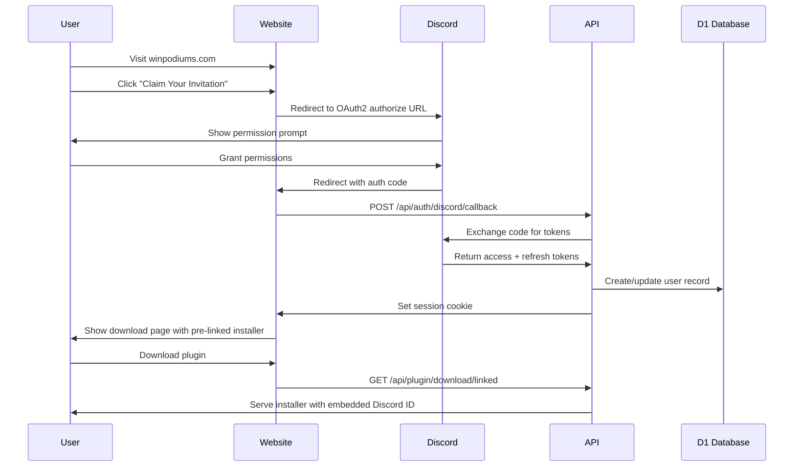
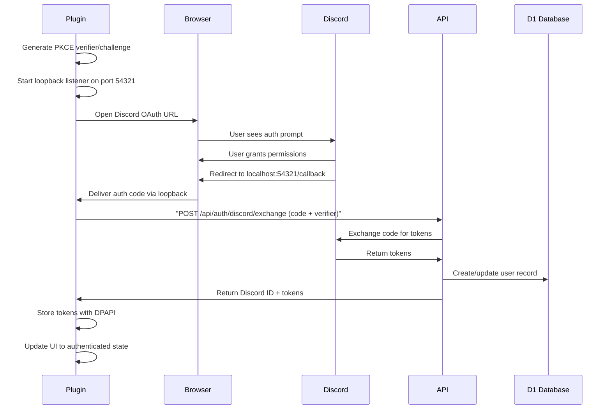
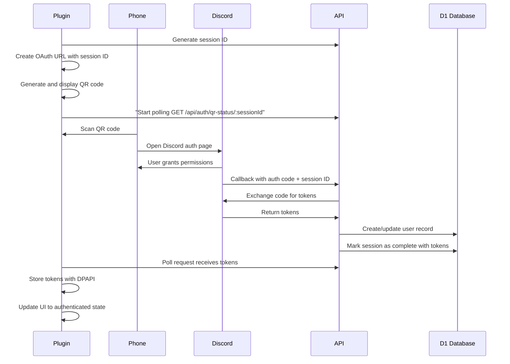
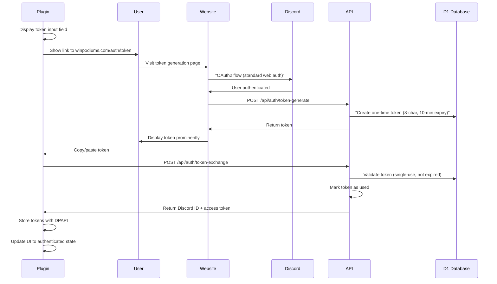

# Low-Level Design: Discord Integration

**Component**: Discord OAuth2 Integration  
**Technology**: OAuth 2.0 Authorization Code + PKCE  
**Endpoints**: Discord OAuth2 API, WinPodiums API

## Overview

Discord serves as the sole identity provider for WinPodiums. Integration supports both web and desktop authentication flows using OAuth 2.0 Authorization Code flow (with PKCE for desktop applications).

## Authentication Flows

### Web-First Authentication



### Plugin Browser Launch Authentication



### Plugin QR Code Authentication



### Plugin Manual Token (Debug Only, Feature-Flagged)

Manual token is **not** a primary or user-facing auth option. It is for debugging only and must be enabled via a feature flag (e.g. debug mode). When enabled, the flow is:



## OAuth 2.0 Parameters

### Discord Authorization URL

```
https://discord.com/oauth2/authorize
  ?client_id={CLIENT_ID}
  &redirect_uri={REDIRECT_URI}
  &response_type=code
  &scope=identify
  &state={STATE}
  &code_challenge={PKCE_CHALLENGE}        # Desktop only
  &code_challenge_method=S256             # Desktop only
```

**Parameters**:
- `client_id`: Discord application ID (public, safe to embed)
- `redirect_uri`: 
  - Web (production): `https://winpodiums.com/api/auth/callback`
  - Web (local): `http://localhost:8787/auth/callback`
  - Plugin Browser: `http://127.0.0.1:{RANDOM_PORT}/callback`
  - Plugin QR: `https://winpodiums.com/auth/qr-callback`
- `response_type`: Always `code` (Authorization Code flow)
- `scope`: `identify` (Discord ID + username only)
- `state`: CSRF protection token (cryptographically random)
- `code_challenge`: PKCE challenge (Base64URL-encoded SHA256 of verifier)
- `code_challenge_method`: `S256` (SHA256 hash method)

### Token Exchange Request

**Web Flow** (API-side):
```http
POST https://discord.com/api/oauth2/token
Content-Type: application/x-www-form-urlencoded

client_id={CLIENT_ID}
&client_secret={CLIENT_SECRET}
&grant_type=authorization_code
&code={AUTHORIZATION_CODE}
&redirect_uri={REDIRECT_URI}
```

**Plugin Flow** (API-side, PKCE):
```http
POST https://discord.com/api/oauth2/token
Content-Type: application/x-www-form-urlencoded

client_id={CLIENT_ID}
&grant_type=authorization_code
&code={AUTHORIZATION_CODE}
&redirect_uri={REDIRECT_URI}
&code_verifier={PKCE_VERIFIER}
```

**Note**: Plugin sends `code_verifier` to API; API uses it to exchange code with Discord. No client secret exposed.

### Token Exchange Response

```json
{
  "access_token": "abc123...",
  "token_type": "Bearer",
  "expires_in": 604800,           // 7 days in seconds
  "refresh_token": "xyz789...",
  "scope": "identify"
}
```

### User Info Request

```http
GET https://discord.com/api/users/@me
Authorization: Bearer {ACCESS_TOKEN}
```

Response:
```json
{
  "id": "123456789",
  "username": "DriverName",
  "discriminator": "1234",
  "avatar": "a_abc123..."
}
```

## Token Management

### Token Storage

**Web** (API-side):
- Access token: Encrypted with Workers Secrets, stored in D1 `AuthToken` table
- Refresh token: Encrypted with Workers Secrets, stored in D1
- Session token: Signed JWT, stored as HTTP-only cookie

**Plugin** (Client-side):
- Access token: Encrypted with Windows DPAPI, stored in `%LocalAppData%\WinPodiums\config.dat`
- Refresh token: Encrypted with Windows DPAPI, same file

### Token Expiry

- **Access Token**: 7 days (Discord default)
- **Refresh Token**: 30 days (Discord default, but single-use rotation)
- **Session Token** (Web): 30 days

### Token Refresh Flow

```typescript
// API-side token refresh (called automatically before expiry)
async function refreshAccessToken(refreshToken: string): Promise<TokenResponse> {
  const response = await fetch('https://discord.com/api/oauth2/token', {
    method: 'POST',
    headers: { 'Content-Type': 'application/x-www-form-urlencoded' },
    body: new URLSearchParams({
      client_id: CLIENT_ID,
      client_secret: CLIENT_SECRET,
      grant_type: 'refresh_token',
      refresh_token: refreshToken,
    }),
  });
  
  if (!response.ok) {
    throw new Error('Token refresh failed');
  }
  
  const tokens = await response.json();
  
  // Update stored tokens in D1
  await updateUserTokens(userId, tokens);
  
  return tokens;
}

// Plugin-side: Check expiry before each API call
if (tokenExpiresAt < DateTime.now().addDays(1)) {
  // Refresh if expires within 1 day
  await apiClient.refreshMyToken();
}
```

## Security Measures

### PKCE Implementation

```typescript
// Code Verifier: 43-128 character random string (base64url)
function generateCodeVerifier(): string {
  const array = new Uint8Array(32); // 256 bits
  crypto.getRandomValues(array);
  return base64urlEncode(array);
}

// Code Challenge: Base64URL(SHA256(verifier))
async function generateCodeChallenge(verifier: string): Promise<string> {
  const encoder = new TextEncoder();
  const data = encoder.encode(verifier);
  const digest = await crypto.subtle.digest('SHA-256', data);
  return base64urlEncode(new Uint8Array(digest));
}
```

### State Validation

```typescript
// Generate state (CSRF protection)
function generateState(): string {
  const array = new Uint8Array(16); // 128 bits
  crypto.getRandomValues(array);
  return base64urlEncode(array);
}

// Validate state on callback
function validateState(receivedState: string, expectedState: string): boolean {
  // Constant-time comparison to prevent timing attacks
  return crypto.timingSafeEqual(
    Buffer.from(receivedState),
    Buffer.from(expectedState)
  );
}
```

### Rate Limiting

Discord API rate limits:
- **Global**: 50 requests per second
- **Per-endpoint**: Varies (usually 5-10 per second)

Mitigation:
- Cache user info for 1 hour (reduce `/users/@me` calls)
- Implement request queue with rate limiter
- Handle `429 Too Many Requests` with exponential backoff

```typescript
// Rate limiter implementation
class DiscordRateLimiter {
  private queue: RequestQueue = [];
  private lastRequest: DateTime;
  private minInterval = 100; // 100ms between requests (10 req/s)
  
  async enqueue<T>(request: () => Promise<T>): Promise<T> {
    return new Promise((resolve, reject) => {
      this.queue.push({ request, resolve, reject });
      this.process();
    });
  }
  
  private async process() {
    if (this.queue.length === 0) return;
    
    // Wait for rate limit window
    const now = DateTime.now();
    const timeSinceLastRequest = now.diff(this.lastRequest).milliseconds;
    
    if (timeSinceLastRequest < this.minInterval) {
      setTimeout(() => this.process(), this.minInterval - timeSinceLastRequest);
      return;
    }
    
    // Execute next request
    const { request, resolve, reject } = this.queue.shift();
    this.lastRequest = DateTime.now();
    
    try {
      const result = await request();
      resolve(result);
    } catch (error) {
      if (error.status === 429) {
        // Rate limited - retry after specified time
        const retryAfter = error.headers.get('Retry-After') * 1000;
        setTimeout(() => {
          this.queue.unshift({ request, resolve, reject });
          this.process();
        }, retryAfter);
      } else {
        reject(error);
      }
    }
    
    // Continue processing queue
    this.process();
  }
}
```

## Error Handling

### Common Errors

| Error | Cause | Mitigation |
|-------|-------|------------|
| `invalid_grant` | Expired or invalid authorization code | User must re-authenticate |
| `invalid_request` | Malformed OAuth request | Validate parameters before sending |
| `access_denied` | User denied permissions | Show friendly message; allow retry |
| `429 Too Many Requests` | Rate limit exceeded | Exponential backoff; queue requests |
| `503 Service Unavailable` | Discord API down | Show status page; implement retry with backoff |

### User-Facing Error Messages

```typescript
function getAuthErrorMessage(error: DiscordError): string {
  switch (error.code) {
    case 'invalid_grant':
      return 'Your authentication session expired. Please try again.';
    case 'access_denied':
      return 'You must grant permissions to link your Discord account.';
    case 'rate_limited':
      return 'Too many authentication attempts. Please wait a moment and try again.';
    case 'service_unavailable':
      return 'Discord authentication is temporarily unavailable. Please try again later.';
    default:
      return 'An unexpected error occurred. Please try again or use an alternative authentication method.';
  }
}
```

## Testing

### Unit Tests
- PKCE generation (verifier, challenge, base64url encoding)
- State generation and validation
- Token encryption/decryption
- Rate limiter behavior

### Integration Tests
- OAuth flow end-to-end (web, plugin browser, plugin QR, plugin manual)
- Token exchange with Discord API (staging environment)
- Token refresh flow
- Error handling (expired codes, denied permissions, rate limits)

### Security Tests
- State parameter validation (CSRF prevention)
- PKCE challenge verification (intercepted code unusable without verifier)
- Token storage encryption (DPAPI, Workers Secrets)
- Rate limit handling (no API abuse)

## Dependencies

### External APIs
- **Discord OAuth2 API**: `https://discord.com/api/oauth2/*`
- **Discord Users API**: `https://discord.com/api/users/@me`

### Libraries
- **Web/API**: Native `fetch`, Web Crypto API
- **Plugin**: `System.Net.Http`, `System.Security.Cryptography`

## Related Documentation

- [Discord OAuth2 Docs](https://discord.com/developers/docs/topics/oauth2)
- [OAuth 2.0 for Native Apps (RFC 8252)](https://datatracker.ietf.org/doc/html/rfc8252)
- [PKCE (RFC 7636)](https://datatracker.ietf.org/doc/html/rfc7636)
- [SimHub Plugin LLD](../components/simhub-plugin.md) — Plugin-side implementation
- [API Authentication Endpoints](../../api/authentication.md) — API endpoint specs
