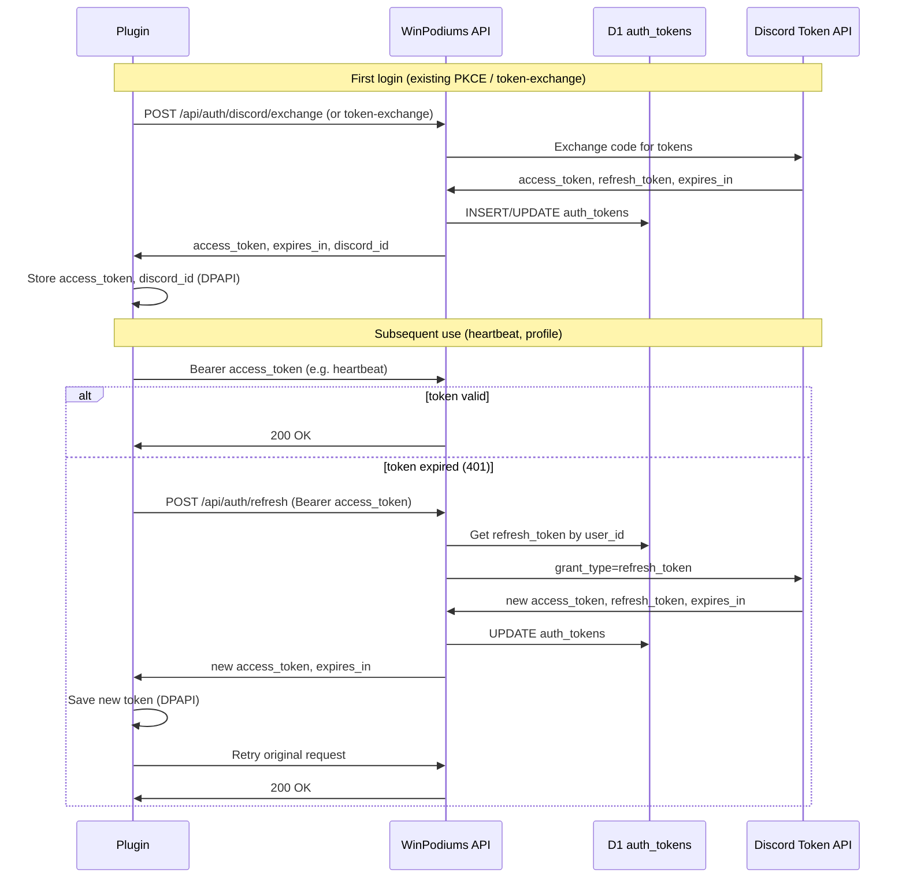

# TP-001: Token Strategy and Mechanism

**Doc type**: Technical Plan | **ID**: TP-001 | **Implements**: [PRD-001: Long-Lived Tokens (SimHub)](../../product/simhub-auth/001-long-lived-tokens.md) | **Related**: [TP-002](002-api-refresh-session.md), [TP-003](003-plugin-storage-refresh.md), [ADR-002 Discord OAuth](../../architecture/decisions/002-discord-oauth.md), [ADR-003 Hybrid Auth](../../architecture/decisions/003-hybrid-auth-paths.md), [Discord Integration LLD](../../design/integrations/discord-integration.md), [Database schema](../../design/data-models/database-schema.md), [auth_tokens migration](../../../apps/api/migrations/0001_initial_schema.sql)

**Status**: Draft  
**Version**: 1.0  
**Date**: 2026-02-01  
**Owner**: Development Team

## Overview

This Technical Plan chooses and specifies the long-lived token mechanism, token format, extended session duration, and high-level data flow for PRD-001. The recommended approach is **Worker-held Discord refresh**: the Worker stores Discord `refresh_token` in D1 and exposes a refresh endpoint; the plugin holds only `access_token` and `discordId` (and optionally `expiresAt`) in DPAPI. When the plugin receives 401, it calls the Worker refresh endpoint with the current Bearer token; the Worker uses D1 `refresh_token` to obtain new Discord tokens and returns a new `access_token` to the plugin. No API-issued session token or plugin-held refresh token is required. Extended period is **30 days** (enforced by Discord refresh token validity and optional proactive refresh); exact value is configurable in Worker config.

## Architecture

### Component Diagram

### Data Flow

1. **Initial login**: User completes Discord OAuth (browser PKCE or manual token). API exchanges code for tokens, stores `access_token`, `refresh_token`, `expires_at` in D1 `auth_tokens`; returns `access_token`, `expires_in`, `discord_id` to plugin. Plugin stores `access_token`, `discord_id` (and optionally `expiresAt`) in DPAPI only; plugin does **not** store `refresh_token`.
2. **Subsequent SimHub launch**: Plugin loads `access_token` and `discord_id` from DPAPI. Plugin uses Bearer `access_token` for protected calls (heartbeat, profile). If token is still valid (Worker accepts it), no refresh is needed.
3. **Refresh path**: When a protected call returns 401, plugin calls `POST /api/auth/refresh` with `Authorization: Bearer {current_access_token}`. Worker resolves user from `auth_tokens` (existing `getUserIdByAccessToken` or equivalent), loads `refresh_token` from D1, calls Discord `POST /oauth2/token` with `grant_type=refresh_token`, updates D1 with new `access_token`/`refresh_token`/`expires_at`, returns new `access_token` and `expires_in` to plugin. Plugin saves new token (and optional expiry) to DPAPI and retries the original request. Only the Worker talks to Discord for refresh; the plugin never holds or sends `refresh_token`.

## Implementation Details (Strategy Only)

### Mechanism Choice

- **Recommended**: Worker holds Discord `refresh_token` in D1; plugin holds only `access_token` (and `discord_id`, optional `expiresAt`) in DPAPI. Plugin triggers refresh by calling Worker `POST /api/auth/refresh` with current Bearer token when it receives 401.
- **Rationale**: (1) Security: refresh token stays server-side; plugin cannot leak it. (2) Simplicity: no new token type (JWT/session) or signing; reuse existing D1 `auth_tokens` and Discord refresh. (3) Discord rate limits: single refresh per user is done by Worker; plugin does not need to call Discord. (4) Revocation: logout clears plugin storage; Worker can optionally invalidate or leave D1 row for future re-auth.

### Token Format

- **Plugin**: No API-issued session token. Plugin uses Discord `access_token` as Bearer token for all protected requests. Refresh is triggered by 401: plugin calls refresh endpoint with that same Bearer token; Worker uses it to resolve `user_id` and then uses D1 `refresh_token` to get new tokens.
- **Worker**: No new JWT or opaque session token for plugin. Existing auth resolution: Bearer token is Discord `access_token`; Worker validates via `getUserIdByAccessToken(DB, token)` (D1 lookup by `access_token` and `expires_at > now`). Refresh endpoint accepts that same Bearer token to identify the user and return a new `access_token`.

### Extended Period

- **Value**: 30 days (configurable in Worker, e.g. env or wrangler config). Discord refresh tokens are long-lived; the “extended period” is effectively the time the user can go without re-authenticating as long as the Worker can refresh using D1 `refresh_token`. A numeric cap (e.g. 30 days) can be enforced by Worker or by optional “session created” timestamp if needed later.
- **Enforcement**: Today, enforcement is via Discord refresh validity and D1 `auth_tokens`. No new column required for “session expires at 30 days”; if Discord revokes refresh or returns 4xx on refresh, Worker returns 401 and plugin shows “Session expired – log in again”.

### What Plugin Stores

- **Current**: `accessToken`, `discordId` (DPAPI), per [TokenStorage](../../../apps/plugin/WinPodiums.Plugin/Auth/TokenStorage.cs).
- **After**: `accessToken`, `discordId`, and optionally `expiresAt` (ISO string or tick count). No `refresh_token` in plugin. Rationale: minimal client storage; refresh is always done via Worker.

### What Worker Stores

- **Current**: D1 `auth_tokens` has `token_id`, `user_id`, `access_token`, `refresh_token`, `expires_at`, `scope`, `created_at`. Worker already stores `refresh_token` but does not use it.
- **After**: Same schema. Worker will **use** `refresh_token`: on `POST /api/auth/refresh`, Worker loads `refresh_token` for the user (resolved from Bearer token), calls Discord refresh, then UPDATEs `access_token`, `refresh_token` (if Discord rotates it), and `expires_at`. No new table or column required.

## Security Considerations

- **No refresh_token in plugin**: Refresh token never leaves the Worker; not in API response body or logs.
- **DPAPI**: Plugin continues to use DPAPI for `access_token` and `discord_id`; no plaintext long-lived secrets on disk.
- **Rate limiting**: Refresh endpoint must be rate-limited per user (or per IP) to prevent abuse (see TP-002).
- **Revocation**: Logout clears plugin storage only. Optional: Worker could mark or delete D1 row on explicit “revoke” call; for MVP, logout is client-side clear only.

## Risks & Mitigations

| Risk | Mitigation |
|------|------------|
| Token theft (access_token) | Access token is short-lived (Discord expiry); refresh is server-side only. Rate limit on refresh. |
| Discord refresh failure (revoked, 4xx) | Worker returns 401; plugin clears storage and shows “Session expired – log in again”. No silent failure. |

## Success Criteria

- Mechanism and token format are unambiguous: Worker refresh, plugin holds only access_token (+ discordId, optional expiresAt).
- TP-002 can implement refresh endpoint and D1/Discord usage without further design choices.
- TP-003 can implement plugin storage (optional expiresAt), refresh trigger on 401, and “session expired” UX without further design choices.

## Related Documentation

- [PRD-001: Long-Lived Tokens (SimHub)](../../product/simhub-auth/001-long-lived-tokens.md)
- [TP-002: API Refresh / Session Endpoint](002-api-refresh-session.md)
- [TP-003: Plugin Token Storage and Refresh Flow](003-plugin-storage-refresh.md)
- [ADR-002 Discord OAuth](../../architecture/decisions/002-discord-oauth.md)
- [ADR-003 Hybrid Auth](../../architecture/decisions/003-hybrid-auth-paths.md)
- [Discord Integration LLD](../../design/integrations/discord-integration.md)
- [OpenAPI spec](../../api/openapi.yaml)
- [Documentation Standards](../../standards/documentation-standards.md)
