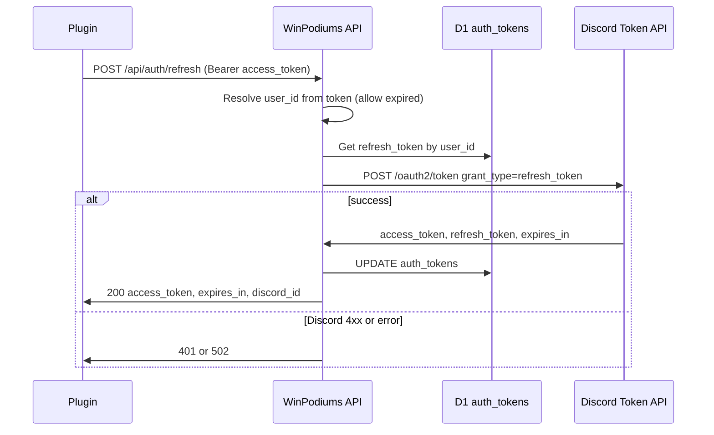

# TP-002: API Refresh / Session Endpoint and Token Lifecycle

**Doc type**: Technical Plan | **ID**: TP-002 | **Implements**: [PRD-001: Long-Lived Tokens (SimHub)](../../product/simhub-auth/001-long-lived-tokens.md) | **Related**: [TP-001](001-token-strategy-mechanism.md), [TP-003](003-plugin-storage-refresh.md), [index.ts](../../../apps/api/src/index.ts), [lib/user.ts](../../../apps/api/src/lib/user.ts), [lib/discord.ts](../../../apps/api/src/lib/discord.ts), [OpenAPI spec](../../api/openapi.yaml)

**Status**: Draft  
**Version**: 1.0  
**Date**: 2026-02-01  
**Owner**: Development Team

## Overview

This Technical Plan implements the Worker-side refresh endpoint and token lifecycle for long-lived tokens. The Worker adds `POST /api/auth/refresh`: the plugin sends the current Bearer (Discord access_token); the Worker resolves the user (including when the access_token is expired), loads `refresh_token` from D1, calls Discord `POST /oauth2/token` with `grant_type=refresh_token`, updates D1 with new tokens, and returns a new `access_token` and `expires_in` to the plugin. No API-issued session token; per TP-001, the plugin continues to use Discord access_token as Bearer. Rate limiting and error handling are specified.

## Architecture

### Component Diagram

### Data Flow

1. Plugin sends `POST /api/auth/refresh` with `Authorization: Bearer {current_access_token}` (may be expired).
2. Worker resolves `user_id` from the token: lookup in `auth_tokens` by `access_token` (must support expired tokens for refresh; see Implementation Details).
3. Worker loads `refresh_token` from D1 for that `user_id` (e.g. `SELECT refresh_token FROM auth_tokens WHERE user_id = ? ORDER BY created_at DESC LIMIT 1`).
4. Worker calls Discord `POST https://discord.com/api/oauth2/token` with `grant_type=refresh_token`, `client_id`, `client_secret`, `refresh_token`.
5. On success: Worker UPDATEs `auth_tokens` with new `access_token`, new `refresh_token` (if Discord returns one), and new `expires_at`; returns 200 with `{ "access_token", "expires_in", "discord_id" }`.
6. On Discord 4xx (e.g. revoked): Worker returns 401; optionally clear or leave D1 row for audit.
7. On Discord network error: Worker may retry once or return 502; plugin shows "try again" or "log in again".

## Implementation Details

### API Endpoints

#### POST /api/auth/refresh

- **Description**: Exchange current (possibly expired) Bearer token for a new Discord access_token. Used by the plugin when a protected call returns 401.
- **Request**
  - **Headers**: `Authorization: Bearer {access_token}` (Discord access_token, may be expired). `Content-Type: application/json` optional; body may be empty.
  - **Body**: Empty or `{}`.
- **Response 200 OK**
  - **Body**: `{ "access_token": string, "expires_in": number, "discord_id": string }`. `expires_in` is seconds until access_token expiry. Do not return `refresh_token`.
- **Response 401 Unauthorized**
  - **Body**: `{ "error": "unauthorized", "message": "Invalid or expired token" }` (or equivalent). When Discord returns 4xx on refresh (revoked), or when user_id cannot be resolved, or when no refresh_token in D1.
- **Response 429 Too Many Requests**
  - **Body**: `{ "error": "rate_limited", "message": "Too many refresh attempts" }`. Include `Retry-After` header when applicable.
- **Response 502 Bad Gateway**
  - **Body**: Optional; when Discord is unreachable or returns 5xx after retry.
- **Documentation**: Add to [OpenAPI spec](../../api/openapi.yaml) and [API plugin doc](../../api/plugin.md).

### Discord Refresh

- **New function in [lib/discord.ts](../../../apps/api/src/lib/discord.ts)**: `refreshAccessToken(refreshToken: string, clientId: string, clientSecret: string): Promise<DiscordTokenResponse>`. Call `POST https://discord.com/api/oauth2/token` with `Content-Type: application/x-www-form-urlencoded` and body: `client_id`, `client_secret`, `grant_type=refresh_token`, `refresh_token`. Parse response as `DiscordTokenResponse` (access_token, refresh_token, expires_in). Throw on non-ok response (caller will map to 401 or 502).
- **Handling Discord 4xx**: If Discord returns 400/401 (e.g. refresh token revoked), do not retry; return 401 to plugin. Optionally delete or mark the D1 row so the user must re-auth; for MVP, returning 401 is sufficient.
- **Handling Discord 5xx / network error**: Retry once with backoff or fail immediately; return 502 so plugin can show "try again" or "log in again".

### D1 Usage

- **Resolve user from Bearer token (including expired)**: Current [getUserIdByAccessToken](../../../apps/api/src/lib/user.ts) only returns user when `expires_at > now`. For refresh, the plugin sends an expired access_token, so add a helper (e.g. `getUserIdByAccessTokenAllowExpired(db, accessToken)`) that selects `user_id` from `auth_tokens` where `access_token = ?` (no `expires_at` check), or reuse a single function with a parameter. Use this only in the refresh path.
- **Load refresh_token**: `SELECT refresh_token, user_id FROM auth_tokens WHERE user_id = ? ORDER BY created_at DESC LIMIT 1`. If no row or refresh_token is null, return 401.
- **Update after successful Discord refresh**: `UPDATE auth_tokens SET access_token = ?, refresh_token = ?, expires_at = ? WHERE user_id = ?` (use the same token_id row; ensure only one row per user or update the latest). Use current time + expires_in for new `expires_at`.
- **Schema**: No migration required; existing `auth_tokens` has `access_token`, `refresh_token`, `expires_at`.

### Auth Resolution

- **Existing getAuth()**: Continues to accept Bearer token and resolve via `getUserIdByAccessToken` (valid token only) for protected routes. Refresh endpoint uses the new “allow expired” lookup so the plugin can refresh with an expired access_token.
- **No session token**: Per TP-001, no JWT or opaque session token; refresh endpoint accepts Discord access_token only.

### Rate Limiting

- **Per user or per IP**: Limit refresh requests (e.g. max 10 per minute per user, or per IP if user is not yet resolved). Return 429 with `Retry-After` (e.g. 60). Implement in Worker (e.g. KV key `refresh:rate:{user_id}` or `refresh:rate:{ip}` with TTL 60; increment and reject if over threshold). Document in Security section.

### Error Handling

| Condition | Response | Notes |
|-----------|----------|--------|
| Missing Authorization header or Bearer token | 401 | Invalid or expired token |
| User not found from token (e.g. unknown access_token) | 401 | |
| No refresh_token in D1 for user | 401 | User must re-auth |
| Discord 400/401 (refresh revoked) | 401 | Do not retry; optionally clear D1 row |
| Discord 5xx or network error | 502 | Optional single retry |
| Rate limit exceeded | 429 | Retry-After header |

## Testing Strategy

- **Unit**: Mock Discord token endpoint; assert Worker calls Discord with correct body (grant_type=refresh_token, refresh_token), updates D1, returns 200 with access_token and expires_in; assert 401 when Discord returns 400/401; assert 429 when rate limit exceeded.
- **Integration**: Local Worker + D1; mock or real Discord refresh; plugin or curl sends POST /api/auth/refresh with expired token; assert new token returned and D1 updated.
- **Contract**: Request/response shape for POST /api/auth/refresh matches OpenAPI; 401/429/502 bodies and headers.

## Security Considerations

- **Rate limiting**: Required on refresh endpoint to prevent abuse and token theft amplification.
- **No refresh_token in response or logs**: Response body must not include refresh_token; logs must not log access_token or refresh_token.
- **Client secret**: Discord refresh uses client_id and client_secret (from env); keep in Worker env only, never in plugin or client.

## Dependencies

- TP-001 (mechanism: Worker refresh, plugin holds access_token only).
- Discord OAuth2 token endpoint; D1 auth_tokens table.
- Existing [lib/discord.ts](../../../apps/api/src/lib/discord.ts), [lib/user.ts](../../../apps/api/src/lib/user.ts).

## Risks & Mitigations

| Risk | Mitigation |
|------|------------|
| Discord downtime | Return 502; plugin shows "try again" or "log in again". |
| Refresh abuse | Rate limit per user (or IP); short-lived access tokens. |

## Success Criteria

- POST /api/auth/refresh is implemented and documented in OpenAPI.
- Worker resolves user from (possibly expired) access_token, loads refresh_token from D1, calls Discord refresh, updates D1, returns new access_token and expires_in.
- 401/429/502 and rate limiting behave as specified. TP-003 can call this endpoint from the plugin.

## Related Documentation

- [PRD-001: Long-Lived Tokens (SimHub)](../../product/simhub-auth/001-long-lived-tokens.md)
- [TP-001: Token Strategy and Mechanism](001-token-strategy-mechanism.md)
- [TP-003: Plugin Token Storage and Refresh Flow](003-plugin-storage-refresh.md)
- [OpenAPI spec](../../api/openapi.yaml)
- [API plugin](../../api/plugin.md)
- [Documentation Standards](../../standards/documentation-standards.md)
