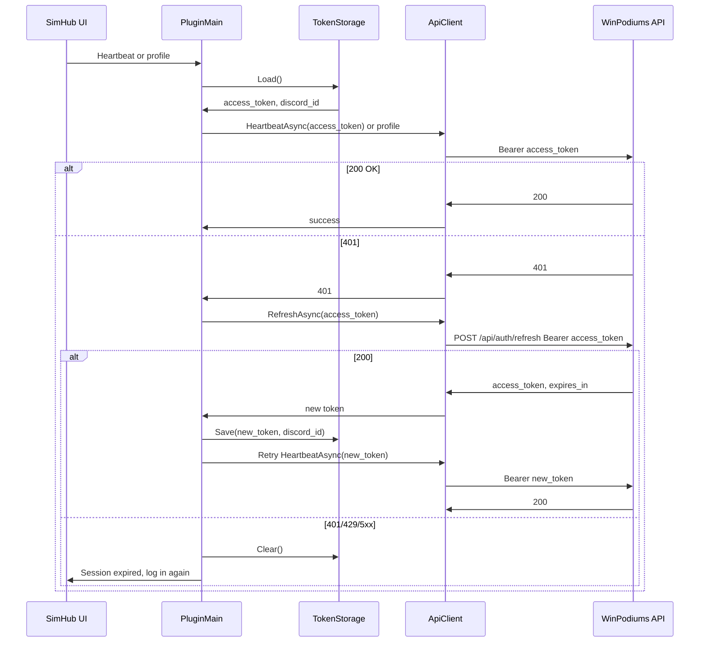

# TP-003: Plugin Token Storage and Refresh Flow

**Doc type**: Technical Plan | **ID**: TP-003 | **Implements**: [PRD-001: Long-Lived Tokens (SimHub)](../../product/simhub-auth/001-long-lived-tokens.md) | **Related**: [TP-001](001-token-strategy-mechanism.md), [TP-002](002-api-refresh-session.md), [TokenStorage](../../../apps/plugin/WinPodiums.Plugin/Auth/TokenStorage.cs), [PluginMain](../../../apps/plugin/WinPodiums.Plugin/Core/PluginMain.cs), [ApiClient](../../../apps/plugin/WinPodiums.Plugin/Services/ApiClient.cs), [TP-SPOC-002](../../simhub-plugin-poc/002-auth-pkce-token-storage.md)

**Status**: Draft  
**Version**: 1.0  
**Date**: 2026-02-01  
**Owner**: Development Team

## Overview

This Technical Plan implements the plugin-side changes for long-lived tokens: extend TokenStorage to optionally store `expiresAt`, add a refresh API call (RefreshAsync), trigger refresh on 401 from protected calls, surface "session expired" when refresh fails, and ensure logout clears all stored credentials. Per TP-001, the plugin holds only `access_token` and `discord_id` (and optional `expiresAt`); refresh is triggered by calling the Worker refresh endpoint with the current Bearer token when the plugin receives 401.

## Architecture

### Component Diagram

### Data Flow

1. **On startup or before first API call**: Load from TokenStorage via `Load()`: `access_token`, `discord_id` (and optionally `expiresAt` if stored). Backward compatibility: existing installs have payload `discordId\naccessToken` (two parts); new format may add a third line for `expiresAt` (e.g. `discordId\naccessToken\nexpiresAt`). If only two parts, treat as no expiry (or derive from optional proactive refresh logic).
2. **On each protected call (e.g. heartbeat, profile)**: Send Bearer `access_token`. If response is 401: call refresh once (POST /api/auth/refresh with same Bearer token). If refresh returns 200: update TokenStorage with new access_token (and optional expiresAt); retry the original request with new token. If refresh returns 401/429/5xx or network error: treat as session expired: call TokenStorage.Clear(), set IsAuthenticated false, show "Session expired – please log in again" in UI; do not leave "Linked" with a broken token.
3. **Logout**: Call TokenStorage.Clear() (wipes entire file); set UI to "Not linked". Any new stored fields (e.g. expiresAt) are part of the same file, so a single Clear() removes all.

## Implementation Details

### Token Storage (DPAPI)

- **Payload format (per TP-001)**: Plugin stores `access_token` and `discord_id`; optionally `expiresAt` (ISO string or Unix seconds). Recommended: `discordId\naccessToken\nexpiresAt` (three lines); if `expiresAt` is empty, use two lines for backward compatibility.
- **Extend [TokenStorage](../../../apps/plugin/WinPodiums.Plugin/Auth/TokenStorage.cs)**:
  - **Save**: Add overload or optional parameter: `Save(string accessToken, string discordId, string? expiresAt = null)`. Serialize as `discordId\naccessToken` or `discordId\naccessToken\nexpiresAt`. Same DPAPI and path (GetConfigPath() unchanged).
  - **Load**: Return `(string? AccessToken, string? DiscordId, string? ExpiresAt)`. Parse payload: if 2 parts, return (accessToken, discordId, null); if 3 parts, return (accessToken, discordId, expiresAt). Backward compatibility: old files (2 parts) still load correctly.
  - **Clear**: No change; single Clear() deletes the file and removes all stored data.
- **Location**: Unchanged; `%LocalAppData%\WinPodiums\config.dat` via GetConfigPath(). DataProtectionScope.CurrentUser.

### Refresh Trigger

- **Strategy chosen**: **On 401 from any protected call**: try refresh once, then retry the request. If refresh fails (401/429/5xx or network error), treat as session expired: clear storage and show "Session expired – please log in again".
- **Optional (future)**: Proactive refresh before expiry: if `expiresAt` is within N minutes (e.g. 5), refresh on next use. Not required for MVP; document as optional enhancement in Out of Scope or Future.

### ApiClient

- **New method**: `RefreshAsync(string accessToken): Task<RefreshResult?>`. POST to `{_baseUrl}/api/auth/refresh` with `Authorization: Bearer {accessToken}`. Body: empty or `{}`. Parse response: 200 → return `RefreshResult { AccessToken, ExpiresIn, DiscordId }`; 401/429/5xx → return null or throw; do not retry in a loop (single attempt or one retry only). Do not log access_token or response body tokens.
- **RefreshResult**: Class or struct with `AccessToken`, `ExpiresIn` (seconds), `DiscordId` (optional, for consistency).

### PluginMain / UI

- **After successful refresh**: Call `TokenStorage.Save(newAccessToken, discordId, newExpiresAt)` (compute newExpiresAt from current time + expires_in if storing expiry). Update any in-memory state so subsequent calls use the new token.
- **On "session expired"**: Call `TokenStorage.Clear()`. Set IsAuthenticated false (or equivalent). Show "Session expired – please log in again" (or similar) in the plugin UI; do not leave status as "Linked" when API calls would fail.
- **Heartbeat and other calls**: Before sending heartbeat (or profile), load token from TokenStorage. On 401 from heartbeat (or profile): call RefreshAsync(currentAccessToken). If RefreshAsync returns new token: Save it, retry heartbeat (or profile) with new token; if success, show success. If RefreshAsync fails or returns null: run session-expired flow above (Clear, show "Session expired – please log in again").

### Heartbeat and Protected Calls

- **Existing path**: [PluginMain](../../../apps/plugin/WinPodiums.Plugin/Core/PluginMain.cs) calls [ApiClient.HeartbeatAsync](../../../apps/plugin/WinPodiums.Plugin/Services/ApiClient.cs) with stored access token. Extend: wrap HeartbeatAsync (and any other protected call) in a helper that: (1) loads token; (2) calls API; (3) if 401, calls RefreshAsync, then Save and retry once; (4) if still 401 or refresh failed, run session-expired flow and do not report success.
- **Profile**: If plugin calls GET /api/profile/me or similar, same pattern: on 401, refresh once and retry; on refresh failure, session expired.

### Logout (FR-003)

- **Existing**: TokenStorage.Clear() and UI update to "Not linked". Ensure Clear() removes the entire file so any new fields (e.g. expiresAt) are also cleared. No separate "clear refresh token" needed because plugin does not store refresh_token.

### Error Handling

| Condition | Behavior |
|-----------|----------|
| Network error during refresh | Treat as session expired; clear storage; show "Session expired" or "Check connection – log in again". |
| 429 from refresh | Show "Too many attempts – try again later" or "Session expired – log in again"; clear storage. |
| 401 from refresh | Session expired; clear storage; show "Session expired – please log in again". |
| 502 from refresh | Show "Server error – try again" or "Session expired – log in again"; optionally do not clear storage so user can retry once more; document chosen behavior. |

## Testing Strategy

- **Unit**: TokenStorage: Save with 2 and 3 parts; Load returns correct tuple; backward compatibility (old 2-part file loads as (token, discordId, null)). Clear removes file.
- **Contract**: ApiClient.RefreshAsync: mock Worker; assert request URL, method, Authorization header; assert response parsing (200 → RefreshResult; 401 → null or exception).
- **Manual**: Login (PKCE) → close SimHub → reopen → heartbeat without re-auth. Force 401 (e.g. expire token or mock): trigger heartbeat → expect refresh or "Session expired". Logout → confirm "Not linked" and heartbeat fails until re-auth.

## Security Considerations

- **No tokens in logs**: Do not log access_token, refresh_token, or session tokens in plugin code or diagnostics.
- **DPAPI only**: Continue to use DPAPI for all stored credentials; no plaintext tokens on disk.
- **No refresh_token in plugin**: Per TP-001, plugin does not store or send refresh_token; only access_token is stored and sent.

## Dependencies

- TP-001 (what to store: access_token, discord_id, optional expiresAt; no refresh_token).
- TP-002 (refresh endpoint contract: POST /api/auth/refresh, request/response shape).

## Risks & Mitigations

| Risk | Mitigation |
|------|------------|
| Old plugin version with new storage format | Backward compatibility: Load() accepts 2-part payload; Save() can write 2 or 3 parts; old clients ignore third part. |
| UI flicker on refresh | Minimize visible state change; e.g. show "Updating…" briefly or retry in background so user sees "Linked" and success without intermediate "Not linked". |

## Success Criteria

- Plugin remains authenticated across SimHub restarts within the extended period (token valid or refresh succeeds).
- On 401, plugin attempts refresh once; on success, saves new token and retries; on failure, clears storage and shows "Session expired – please log in again".
- Logout clears all stored credentials; after logout, user must log in again for protected calls.
- TP-004 can define E2E scenarios against this behavior.

## Related Documentation

- [PRD-001: Long-Lived Tokens (SimHub)](../../product/simhub-auth/001-long-lived-tokens.md)
- [TP-001: Token Strategy and Mechanism](001-token-strategy-mechanism.md)
- [TP-002: API Refresh / Session Endpoint](002-api-refresh-session.md)
- [TP-SPOC-002: Auth (PKCE, Token Storage)](../../simhub-plugin-poc/002-auth-pkce-token-storage.md)
- [SimHub Plugin LLD](../../design/components/simhub-plugin.md)
- [Documentation Standards](../../standards/documentation-standards.md)
