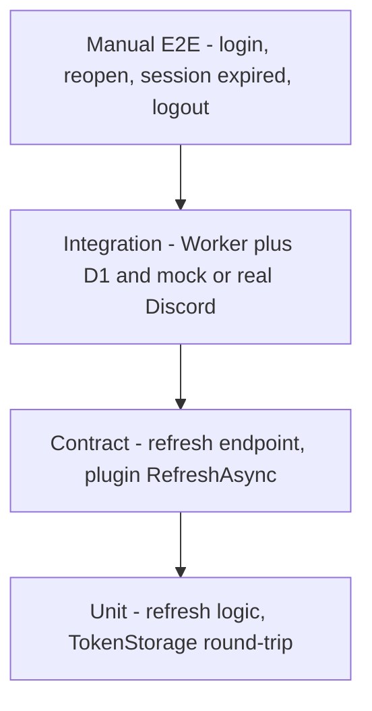

# TP-004: Long-Lived Tokens Testing and Completion

**Doc type**: Technical Plan | **ID**: TP-004 | **Implements**: [PRD-001: Long-Lived Tokens (SimHub)](../../product/simhub-auth/001-long-lived-tokens.md) | **Related**: [TP-001](001-token-strategy-mechanism.md), [TP-002](002-api-refresh-session.md), [TP-003](003-plugin-storage-refresh.md), [development guide](../../guides/development.md), [TP-SPOC-005](../../simhub-plugin-poc/005-poc-testing-completion.md)

**Status**: Draft  
**Version**: 1.0  
**Date**: 2026-02-01  
**Owner**: Development Team

## Overview

This Technical Plan defines the testing and completion criteria for the long-lived tokens feature (PRD-001). "Done" means: manual E2E scenarios (happy path, session expired, logout) pass and are documented; automated tests (unit, contract, optional integration) cover refresh endpoint, plugin storage, and 401/refresh flow; security and rate-limit checks are satisfied. No requirement for SimHub-in-CI; manual E2E can be documented in the development guide or next-steps.

## Architecture

### Test Pyramid

- **Manual E2E**: Login once, close SimHub, reopen, session expired path, logout; documented so any developer can run and confirm completion.
- **Integration**: Worker + D1 + mocked or real Discord refresh; plugin calling local Worker with real refresh (or stub).
- **Contract**: Refresh endpoint request/response shape; ApiClient.RefreshAsync with mocked HTTP.
- **Unit**: Worker refresh flow with mocked Discord; TokenStorage Save/Load/Clear and backward compatibility.

## Implementation Details

### Manual E2E

#### Happy path

1. Fresh install or logout (plugin shows "Not linked").
2. Link to Discord (browser PKCE); send heartbeat → success.
3. Close SimHub completely.
4. Reopen SimHub; open plugin; confirm still "Linked".
5. Send heartbeat → success without re-authenticating.
6. Repeat steps 4–5 at least once more (e.g. next day or after token would have expired without refresh) to cover extended-period behavior. If token would expire before then, either wait or force expiry (see Session expired) to verify refresh path.

#### Session expired

1. Plugin is linked (has stored token).
2. Invalidate token: e.g. revoke in Discord developer portal, or wait until access_token expires and ensure refresh is triggered (or mock 401 from API for testing).
3. Trigger API call (e.g. heartbeat).
4. Expect: "Session expired" or "Log in again" in UI; plugin not left as "Linked" with silent failure. Optionally expect one refresh attempt before showing session expired if token was expired but refresh_token still valid.
5. Re-auth (Link to Discord again); send heartbeat → success.

#### Logout

1. Plugin is linked.
2. User logs out (plugin logout action).
3. Confirm "Not linked"; heartbeat or profile fails until user logs in again.
4. Log in again; heartbeat → success.

### Automated Tests

#### API (Worker)

- **Refresh endpoint contract**: Request (POST /api/auth/refresh, Authorization Bearer); response 200 body shape (access_token, expires_in, discord_id); 401/429/502 body and headers. Align with OpenAPI.
- **Unit**: Refresh flow with mocked Discord token endpoint: assert Worker calls Discord with grant_type=refresh_token, updates D1, returns 200 with new access_token; assert 401 when Discord returns 400/401; assert 429 when rate limit exceeded.
- **Integration (optional)**: Local Worker + D1; real or mocked Discord refresh; POST /api/auth/refresh with expired token; assert new token returned and D1 updated.

#### Plugin

- **TokenStorage**: New format (2-part and 3-part payload) Save/Load round-trip; backward compatibility (old 2-part file loads as (token, discordId, null)); Clear removes file.
- **ApiClient.RefreshAsync**: Mocked HTTP: 200 → returns RefreshResult with access_token, expires_in; 401/429/5xx → returns null or throws; assert request URL, method, Authorization header.
- **Integration (optional)**: Plugin calls local Worker with real refresh (or stub); assert refresh and retry flow.

### Security Checks

- **No tokens in logs**: Code review or grep: no access_token, refresh_token, or session token in log statements or diagnostics in Worker or plugin.
- **Rate limit**: Refresh endpoint returns 429 under load (e.g. 10+ requests per minute per user or per IP); test with script or manual burst.

### CI / Pre-push

- Run Worker tests (e.g. vitest in apps/api): include refresh endpoint and refresh flow tests.
- Run plugin unit/contract tests (e.g. dotnet test or existing repo test command): include TokenStorage and RefreshAsync tests.
- Manual E2E documented in [development guide](../../guides/development.md) or [next-steps](../../architecture/next-steps.md); no mandatory SimHub-in-CI for this feature.

## Testing Strategy

| PRD requirement | Test type | Coverage |
|-----------------|------------|----------|
| FR-001: Extended auth period | Manual E2E happy path | Login once, reopen SimHub, heartbeat without re-auth |
| FR-002: Invalid credential handling | Manual E2E session expired; unit/contract refresh | 401 → refresh or "session expired"; refresh endpoint 401/200 |
| FR-003: Explicit logout | Manual E2E logout | Logout clears state; heartbeat fails until re-auth |
| NFR-001: Security (no tokens in logs) | Security check (grep/code review) | No tokens in logs |
| NFR-002: Reliability (refresh or re-auth) | Unit/contract refresh; E2E session expired | Refresh flow and "session expired" path covered |

- **Coverage goals**: Refresh path (200) and 401 path (refresh failed, session expired) are both covered by unit or contract tests; E2E covers happy path and session expired at least once.

## Deployment

- No extra deployment steps; tests run in dev and CI per existing repo. Document how to run Worker tests and plugin tests in README or development guide.

## Success Criteria

- All manual E2E scenarios (happy path, session expired, logout) pass at least once and are documented.
- Automated tests (Worker refresh, plugin TokenStorage and RefreshAsync) pass in CI.
- Security checklist satisfied: no access_token, refresh_token, or session token in logs; rate limit on refresh returns 429 under load.
- PRD FR-001, FR-002, FR-003, NFR-001, NFR-002 trace to tests (see table above).

## Related Documentation

- [PRD-001: Long-Lived Tokens (SimHub)](../../product/simhub-auth/001-long-lived-tokens.md)
- [TP-001: Token Strategy and Mechanism](001-token-strategy-mechanism.md)
- [TP-002: API Refresh / Session Endpoint](002-api-refresh-session.md)
- [TP-003: Plugin Token Storage and Refresh Flow](003-plugin-storage-refresh.md)
- [development guide](../../guides/development.md)
- [TP-SPOC-005: POC Testing and Completion](../../simhub-plugin-poc/005-poc-testing-completion.md)
- [Documentation Standards](../../standards/documentation-standards.md)
