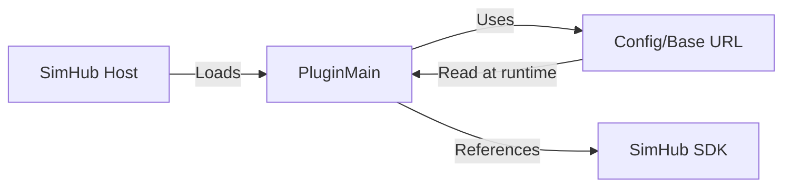

# TP-SPOC-001: Plugin Skeleton, SimHub SDK, and Config

**Doc type**: Technical Plan | **ID**: TP-SPOC-001 | **Implements**: [PRD-001: SimHub Plugin POC](../../product/simhub-plugin-poc/001-simhub-plugin-poc.md) | **Related**: [SimHub Plugin LLD](../../design/components/simhub-plugin.md), [API plugin](../../api/plugin.md), [ADR-002](../../architecture/decisions/002-discord-oauth.md), [ADR-003](../../architecture/decisions/003-hybrid-auth-paths.md), [002: Auth (PKCE, Token Storage)](002-auth-pkce-token-storage.md)

**Status**: Draft  
**Version**: 1.0  
**Date**: 2026-02-01  
**Owner**: Development Team

## Overview

This Technical Plan establishes the plugin project skeleton, SimHub SDK wiring, and configurable API base URL so the plugin loads in SimHub and can target local or production API without recompiling. It implements NFR-001 (load in SimHub) and FR-003 (configurable base URL) from PRD-001. Out of scope: full Scrutineering Panel, position detection, telemetry logic.

## Architecture

### Component Diagram

### Data Flow

1. SimHub loads the plugin DLL and invokes the plugin interface (e.g. `Init`, `DataUpdate`, `End`).
2. Plugin reads config (API base URL) at runtime; no recompile required.
3. All API calls use the configured base URL.

## Implementation Details

### Project Structure

- **Target**: .NET Framework 4.8 class library.
- **Output**: Single DLL (`WinPodiums.Plugin.dll`) plus dependencies.
- **Canonical paths**: SimHub install root `C:\Program Files (x86)\SimHub`, plugins folder `C:\Program Files (x86)\SimHub\Plugins`. Document and reference these in code comments and docs.

**Key files**:

- [apps/plugin/WinPodiums.Plugin/WinPodiums.Plugin.csproj](../../../apps/plugin/WinPodiums.Plugin/WinPodiums.Plugin.csproj) — project file, SimHub SDK reference.
- [apps/plugin/WinPodiums.Plugin/Core/PluginMain.cs](../../../apps/plugin/WinPodiums.Plugin/Core/PluginMain.cs) — plugin entry point and lifecycle.

### SimHub SDK Wiring

- Add SimHub SDK reference to the project (e.g. `SimHubPlugin.dll` from SimHub install path or Plugins folder). Use HintPath as in the csproj comment block.
- Implement the SimHub plugin interface required by the SDK (e.g. `IPlugin`, `IDataPlugin` as per SimHub documentation). Wire `Init(PluginManager)`, `DataUpdate(PluginManager, ref GameData)`, and `End(PluginManager)` so the plugin is recognized by SimHub.
- **“Loads in SimHub”** means the plugin **appears in SimHub’s plugin list/settings and is usable from the SimHub UI** (user can see and interact with the plugin), not only that the DLL loads without crash. Include a short checklist in this TP or the development guide: build → copy DLL to Plugins folder → restart SimHub → confirm plugin appears in list/settings.

### Configurable API Base URL

- **Requirement**: Base URL can be set (e.g. via `SetApiBaseUrl` or config file/settings) without recompiling. All API calls use this base URL.
- **Default**: e.g. `https://winpodiums.com`; local dev e.g. `http://localhost:8787`.
- **Implementation**: Config model or field holding base URL (trimmed, no trailing slash). `PluginMain` (or equivalent) exposes `SetApiBaseUrl(string baseUrl)` and passes the base URL to `ApiClient`. Any new HTTP client or service that calls the API must use the same base URL source.

### Error Handling

- Invalid or null base URL: fall back to default production URL; do not throw in normal flow.
- SimHub SDK not found at build/reference path: build can optionally warn; document SDK path and version in README or dev guide.

## Testing Strategy

- **Build**: Project builds and produces the DLL for .NET 4.8.
- **Manual**: After SDK wiring, install plugin in SimHub and confirm it appears in plugin list/settings (POC “loads in SimHub” criterion).
- **Config**: Unit test or manual check that `SetApiBaseUrl` (or config) changes the base URL used by the API client (e.g. stub or mock that records the URL).

## Deployment

- **Build**: Compile plugin DLL; no installer required for POC (manual copy to SimHub Plugins folder).
- **Configuration**: Document how to set API base URL (e.g. in SimHub plugin settings or config file) for local dev.

## Performance Considerations

- No performance-critical path in skeleton/config; startup and config read should be negligible.

## Security Considerations

- No secrets in config or repo; API base URL is not sensitive. Do not store tokens in config files.

## Dependencies

- **SimHub SDK**: Required for POC complete; version and path documented.
- **.NET Framework 4.8**: Required for SimHub compatibility.
- **Internal**: ApiClient (or equivalent) must accept base URL from this config.

## Risks & Mitigations

| Risk | Mitigation |
|------|------------|
| SimHub SDK path/version differs per environment | Document canonical path and version; optional HintPath or env-based path. |
| Plugin not appearing in SimHub UI | Verify interface implementation and SimHub docs; checklist for “appears in list/settings”. |

## Success Criteria

- Plugin builds as .NET Framework 4.8 class library.
- SimHub SDK is referenced and plugin entry point implements the SimHub plugin interface.
- Plugin appears in SimHub’s plugin list/settings and is usable from the SimHub UI.
- API base URL is configurable at runtime (e.g. `SetApiBaseUrl` or config) and used by all API calls.

## Related Documentation

- [PRD-001: SimHub Plugin POC](../../product/simhub-plugin-poc/001-simhub-plugin-poc.md)
- [SimHub Plugin LLD](../../design/components/simhub-plugin.md)
- [API plugin](../../api/plugin.md)
- [002: Auth (PKCE, Token Storage)](002-auth-pkce-token-storage.md)
- [Documentation Standards](../../standards/documentation-standards.md)
