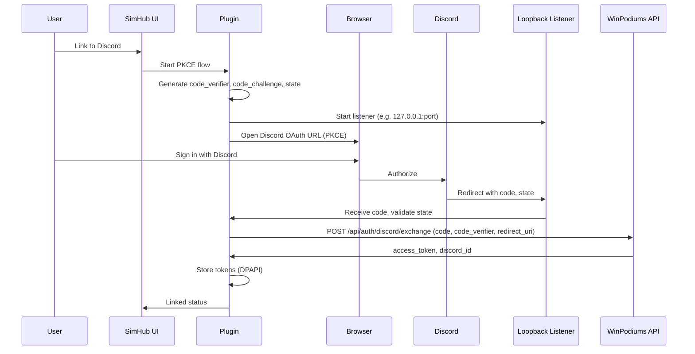

# TP-SPOC-002: Auth (PKCE, Token Storage)

**Doc type**: Technical Plan | **ID**: TP-SPOC-002 | **Implements**: [PRD-SPOC-001: SimHub Plugin POC](../../product/simhub-plugin-poc/001-simhub-plugin-poc.md) | **Related**: [SimHub Plugin LLD](../../design/components/simhub-plugin.md), [API plugin](../../api/plugin.md), [API authentication](../../api/authentication.md), [ADR-002](../../architecture/decisions/002-discord-oauth.md), [ADR-003](../../architecture/decisions/003-hybrid-auth-paths.md), [OpenAPI spec](../../api/openapi.yaml), [001: Plugin Skeleton](001-plugin-skeleton-sdk-config.md), [003: API Client and Heartbeat](003-api-client-heartbeat.md)

**Status**: Draft  
**Version**: 1.0  
**Date**: 2026-02-01  
**Owner**: Development Team

## Overview

This Technical Plan implements browser-based Discord OAuth (PKCE), loopback callback, token exchange with the API, and DPAPI-backed token storage. Manual token auth is supported only as a debugging feature behind a feature flag (FR-001, FR-001b). It aligns with the API’s `POST /api/auth/discord/exchange` and optional `POST /api/auth/token-exchange` per the OpenAPI spec.

## Architecture

### Component Diagram

### Data Flow

1. User triggers “Link to Discord” from plugin UI.
2. Plugin generates PKCE code_verifier and code_challenge (S256), and a random state.
3. Plugin starts an HTTP loopback listener on the fixed port 54321 (see "Loopback Listener" and "Discord App: Redirect URI Configuration" below).
4. Plugin opens the system browser to the Discord OAuth URL including `redirect_uri=http://127.0.0.1:54321/callback`, `code_challenge`, `code_challenge_method=S256`, `state`, and `scope=identify`.
5. User signs in with Discord; Discord redirects to the loopback URL with `code` and `state`.
6. Plugin validates `state`, then calls `POST /api/auth/discord/exchange` with `code`, `code_verifier`, and `redirect_uri` (e.g. `http://127.0.0.1:54321/callback`). Request/response schema must align with [OpenAPI spec](../../api/openapi.yaml).
7. API returns access token and Discord ID; plugin stores them with DPAPI (user-scoped) via [TokenStorage](../../../apps/plugin/WinPodiums.Plugin/Auth/TokenStorage.cs).
8. Manual token (debug only): If a feature flag is enabled, plugin may expose a path to paste a one-time token and call `POST /api/auth/token-exchange`. This must be hidden from normal UI and not documented as a primary auth method.

## Implementation Details

### PKCE Generation

- **Code verifier**: Cryptographically random string (e.g. 32–64 bytes), base64url-encoded.
- **Code challenge**: Base64url(SHA256(utf8(code_verifier))). Method `S256`.

### Loopback Listener (Fixed Port — Recommended for Security)

- **Fixed port**: Use a single well-known port so exactly one redirect URI is registered in the Discord app. Canonical port: **54321**. Bind to `http://127.0.0.1:54321/callback/` (or equivalent). Use 127.0.0.1 (not localhost) for consistency.
- Timeout: e.g. 5 minutes; then close listener and report failure/cancellation.
- On request: validate `state` query parameter; read `code`; return a simple HTML page (“Success, you can close this window”); then close listener.
- Use the same `redirect_uri` in the Discord URL and in the exchange request body.

### Discord App: Redirect URI Configuration

- In the Discord Developer Portal, add **exactly one** redirect URI for the plugin: `http://127.0.0.1:54321/callback`. Discord does not support wildcards. A fixed port keeps the surface small and makes configuration auditable.
- If port 54321 is in use on a developer machine, document the override (e.g. config) and ensure the same URI is registered in Discord for that environment.

### Token Exchange

- **Endpoint**: `POST {baseUrl}/api/auth/discord/exchange`. Body: `code`, `code_verifier`, `redirect_uri` (and any other fields required by the OpenAPI spec). Headers: `Content-Type: application/json`.
- Parse response for access_token and discord_id (or equivalent); handle 400/401 and network errors.

### Token Storage (DPAPI)

- **Location**: User-scoped, e.g. `%LocalAppData%\WinPodiums\config.dat` (or equivalent). Use [TokenStorage.GetConfigPath()](../../../apps/plugin/WinPodiums.Plugin/Auth/TokenStorage.cs) for consistency.
- **Format**: Persist access token and Discord ID; encrypt with `ProtectedData.Protect` (DataProtectionScope.CurrentUser). POC persists only access_token and discord_id; do not store refresh token unless the API contract requires it.
- **APIs**: Save after successful exchange; Load on startup or when checking IsAuthenticated; Clear on logout.

### Manual Token (Debug Only)

- **Feature flag**: Build flag, config flag, or debug-only menu. When disabled, no UI or code path should offer manual token as an option.
- **Flow**: User pastes one-time token; plugin calls `POST /api/auth/token-exchange` with body `{ "token": "..." }`; on success, store tokens same as PKCE. Do not present as primary or recommended auth in UI or docs.

### Error Handling

- State mismatch: Abort, do not exchange code; show error to user.
- Exchange returns 4xx: Show error message; do not save tokens.
- Listener timeout: Close listener; show “Authentication timed out” or similar.
- DPAPI failures: Log; do not expose raw tokens; clear stored data on corrupt read.

## Testing Strategy

- **Unit**: PKCE verifier/challenge generation (deterministic from verifier); DPAPI round-trip (Save then Load returns same data; Clear removes data).
- **Contract**: Mock or stub for `POST /api/auth/discord/exchange`; verify request shape (code, code_verifier, redirect_uri) and response parsing.
- **Manual**: Full browser PKCE flow against local API; confirm tokens stored and IsAuthenticated true; manual token flow with feature flag on.

## Deployment

- No extra deployment steps; DPAPI is per-machine, user-scoped. Ensure plugin runs under the user account that will use it.

## Performance Considerations

- Listener startup and browser launch should complete in a few seconds; exchange call typically &lt; 2s. No continuous background work for auth in POC.

## Security Considerations

- **No client secrets**: PKCE only; no Discord client secret in plugin.
- **State**: Always validate state to prevent CSRF on callback.
- **Tokens**: Stored only with DPAPI (CurrentUser); never log or expose tokens in UI.
- **Redirect URI**: Use 127.0.0.1 (not localhost) and exact match with API/Discord app config.

## Dependencies

- **API**: `POST /api/auth/discord/exchange` (and optionally `POST /api/auth/token-exchange` for debug).
- **Discord**: OAuth2 authorize URL; redirect URI must be allowed in Discord app configuration.
- **Internal**: [TokenStorage](../../../apps/plugin/WinPodiums.Plugin/Auth/TokenStorage.cs), configurable API base URL from 001.

## Risks & Mitigations

| Risk | Mitigation |
|------|------------|
| Port in use | Use random port in range or try next; document required firewall/antivirus for loopback. |
| API contract drift | Align request/response with OpenAPI; add contract tests. |

## Success Criteria

- User can complete “Link to Discord” from UI: browser opens, user signs in, callback returns to plugin, tokens stored, linked status shown.
- Tokens are stored with DPAPI and loaded on next run.
- Manual token flow exists only when feature flag is on and is not presented as primary auth.
- Request/response for exchange match API spec.

## Related Documentation

- [PRD-SPOC-001: SimHub Plugin POC](../../product/simhub-plugin-poc/001-simhub-plugin-poc.md)
- [SimHub Plugin LLD](../../design/components/simhub-plugin.md)
- [API plugin](../../api/plugin.md)
- [API authentication](../../api/authentication.md)
- [OpenAPI spec](../../api/openapi.yaml)
- [001: Plugin Skeleton](001-plugin-skeleton-sdk-config.md)
- [003: API Client and Heartbeat](003-api-client-heartbeat.md)
- [Documentation Standards](../../standards/documentation-standards.md)
