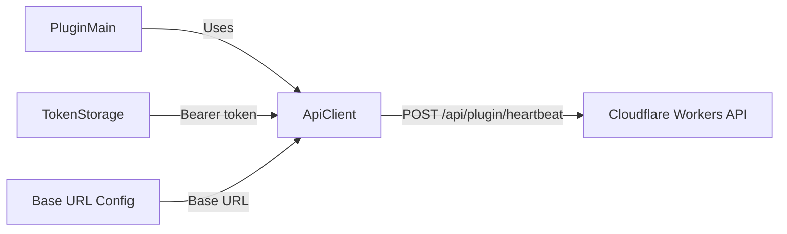

# TP-SPOC-003: API Client and Heartbeat

**Doc type**: Technical Plan | **ID**: TP-SPOC-003 | **Implements**: [PRD-001: SimHub Plugin POC](../../product/simhub-plugin-poc/001-simhub-plugin-poc.md) | **Related**: [SimHub Plugin LLD](../../design/components/simhub-plugin.md), [API plugin](../../api/plugin.md), [ADR-002](../../architecture/decisions/002-discord-oauth.md), [001: Plugin Skeleton](001-plugin-skeleton-sdk-config.md), [002: Auth (PKCE, Token Storage)](002-auth-pkce-token-storage.md), [004: Minimal SimHub UI](004-minimal-simhub-ui.md)

**Status**: Draft  
**Version**: 1.0  
**Date**: 2026-02-01  
**Owner**: Development Team

## Overview

This Technical Plan implements the plugin API client and the single verification API call (heartbeat) required for the POC. It aligns with FR-002: plugin calls the heartbeat endpoint with `Authorization: Bearer {token}` and success/failure is observable (log or minimal status). Contract must align with [API plugin spec](../../api/plugin.md) and OpenAPI.

## Architecture

### Component Diagram

### Data Flow

1. User or plugin triggers “Send heartbeat” (or equivalent).
2. Plugin loads access token from [TokenStorage](../../../apps/plugin/WinPodiums.Plugin/Auth/TokenStorage.cs).
3. API client sends `POST {baseUrl}/api/plugin/heartbeat` with `Authorization: Bearer {accessToken}` and optional body (e.g. `{ "version": "1.0.0" }`).
4. API validates token and returns 200 OK (or 400/401). Plugin surfaces success/failure (log or status) so the user can confirm end-to-end flow.

## Implementation Details

### API Client

- **Base URL**: Use configurable base URL from [001: Plugin Skeleton](001-plugin-skeleton-sdk-config.md). All requests use this base URL (no hardcoded production URL for dev).
- **HTTP client**: Use `HttpClient` with reasonable timeout (e.g. 15s). Set `Accept: application/json` and `Content-Type: application/json` where applicable.
- **Key file**: [apps/plugin/WinPodiums.Plugin/Services/ApiClient.cs](../../../apps/plugin/WinPodiums.Plugin/Services/ApiClient.cs) — extend or align with this TP for heartbeat and any token-exchange used by auth.

### Heartbeat Endpoint

- **Method**: POST.
- **URL**: `{baseUrl}/api/plugin/heartbeat`.
- **Headers**: `Authorization: Bearer {accessToken}`, `Content-Type: application/json`.
- **Body** (per OpenAPI): Optional JSON object, e.g. `{ "version": "1.0.0" }` for plugin version.
- **Response**: 200 OK indicates success; 400/401 indicate failure. Parse error body if present for user-facing message.

### Contract Parity

- Request/response must match [API plugin](../../api/plugin.md) and [OpenAPI spec](../../api/openapi.yaml) for `/plugin/heartbeat`. Rate limit: 1 per 5 minutes per user (server-side); plugin does not need to enforce, but avoid spamming.

### Success/Failure Observable

- On success: Log or set status (e.g. “Heartbeat OK”) so the user can confirm without consulting logs.
- On failure: Log and set status (e.g. “Heartbeat failed” or last error message). Do not crash the plugin; surface error for debugging.

### Error Handling

- Missing or invalid token: Do not send request; return failure and optionally prompt to “Link to Discord”.
- Network/timeout: Catch exception; log and set failure status; optionally retry once (POC minimum: one attempt is acceptable).
- 401: Treat as “not authenticated”; clear or refresh token per product decision (POC: show failure, user can re-link).

## Testing Strategy

- **Unit**: API client heartbeat method against mock or stub: verify request URL, method (POST), Authorization header, body shape; verify success/failure handling and that success/failure is observable (e.g. return value or callback).
- **Contract**: Stub server or recorded response; assert request matches OpenAPI (URL, headers, body) and response parsing (200 vs 4xx).
- **Integration** (optional for POC): Call real local Worker with valid token; confirm 200 and status update.

## Deployment

- No extra deployment; API client is part of plugin DLL. Ensure base URL is configurable for local vs production.

## Performance Considerations

- Single heartbeat on user action; no continuous background heartbeat required for POC. Latency target: &lt; 2s round-trip typical.

## Security Considerations

- **Token**: Never log or expose access token; use only in Authorization header.
- **HTTPS**: Use HTTPS for production base URL; HTTP only for local dev (e.g. localhost:8787).

## Dependencies

- **API**: `POST /api/plugin/heartbeat` per [API plugin](../../api/plugin.md) and OpenAPI.
- **Internal**: TokenStorage (load token), configurable base URL from 001.

## Risks & Mitigations

| Risk | Mitigation |
|------|------------|
| API contract drift | Align with OpenAPI; add contract/unit tests. |
| Token expired | 401 handling; user re-links (POC); future: refresh flow. |

## Success Criteria

- Plugin can call `POST /api/plugin/heartbeat` with `Authorization: Bearer {token}` using configurable base URL.
- Success/failure is observable (log or minimal status).
- Request/response contract aligns with API plugin spec and OpenAPI.

## Related Documentation

- [PRD-001: SimHub Plugin POC](../../product/simhub-plugin-poc/001-simhub-plugin-poc.md)
- [SimHub Plugin LLD](../../design/components/simhub-plugin.md)
- [API plugin](../../api/plugin.md)
- [001: Plugin Skeleton](001-plugin-skeleton-sdk-config.md)
- [002: Auth (PKCE, Token Storage)](002-auth-pkce-token-storage.md)
- [004: Minimal SimHub UI](004-minimal-simhub-ui.md)
- [Documentation Standards](../../standards/documentation-standards.md)
