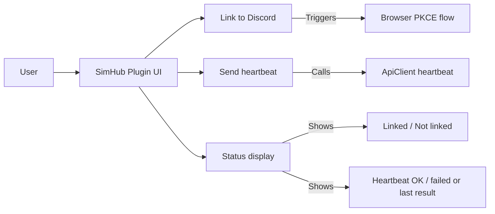

# TP-SPOC-004: Minimal SimHub UI

**Doc type**: Technical Plan | **ID**: TP-SPOC-004 | **Implements**: [PRD-001: SimHub Plugin POC](../../product/simhub-plugin-poc/001-simhub-plugin-poc.md) | **Related**: [SimHub Plugin LLD](../../design/components/simhub-plugin.md), [API plugin](../../api/plugin.md), [001: Plugin Skeleton](001-plugin-skeleton-sdk-config.md), [002: Auth (PKCE, Token Storage)](002-auth-pkce-token-storage.md), [003: API Client and Heartbeat](003-api-client-heartbeat.md)

**Status**: Implemented  
**Version**: 1.0  
**Date**: 2026-02-01  
**Owner**: Development Team

**Implementation**: Plugin implements IWPFSettings; GetWPFSettingsControl returns `UI/SettingsControl` (WPF UserControl). Settings panel is shown when WinPodiums is selected in the enabled feature menu on the left. See `apps/plugin/WinPodiums.Plugin/Core/PluginMain.cs` and `apps/plugin/WinPodiums.Plugin/UI/SettingsControl.xaml`.

## Overview

This Technical Plan implements the minimal SimHub UI required for the POC (FR-004): user can trigger “Link to Discord” and “Send heartbeat” from the plugin UI and see status (Linked/Not linked, Heartbeat OK/failed or last result). Full Scrutineering Panel and design polish are out of scope.

## Architecture

### Component Diagram

### Data Flow

1. **Link to Discord**: User clicks “Link to Discord” (or equivalent). Plugin starts browser PKCE flow per [002: Auth (PKCE, Token Storage)](002-auth-pkce-token-storage.md). On success, UI shows “Linked” (and optionally Discord ID or username). On failure, show error or “Not linked”.
2. **Send heartbeat**: User clicks “Send heartbeat” (or equivalent). Plugin calls API client heartbeat per [003: API Client and Heartbeat](003-api-client-heartbeat.md). UI shows “Heartbeat OK” on success or “Heartbeat failed” / last error on failure.
3. **Status**: UI always shows auth status (Linked / Not linked) and last heartbeat result (Heartbeat OK / Heartbeat failed or last result) so the user can confirm the flow without consulting logs.

## Implementation Details

### UI Elements (Minimal)

- **Status**: Auth “Linked” or “Not linked” (and optionally Discord ID when linked). Heartbeat: “Heartbeat OK”, “Heartbeat failed”, or last result message.
- **API base URL**: Editable text box + Save button; persisted via SimHub property “WinPodiums.ApiBaseUrl” and applied via SetApiBaseUrl.
- **Link to Discord**: Button that opens the browser to `{baseUrl}/auth/discord`. Visible when not authenticated; after success (e.g. via manual token paste), status shows “Linked” and Log out is available.
- **Log out**: Button that clears stored tokens; status returns to “Not linked”.
- **Manual token (optional)**: 8-character token text box + “Paste token” button; calls AuthenticateWithManualTokenAsync. Debug-only; not presented as primary auth.
- **Send heartbeat**: Button that sends one heartbeat to the API. Enabled when authenticated. On click, call heartbeat; update “Heartbeat OK” or “Heartbeat failed” (or last result) in the UI.

### SimHub UI Integration

- **Surfaces**: Plugin must appear in SimHub’s plugin list/settings and be **accessible via the enabled feature menu on the left**. When the user selects WinPodiums in that menu, **all settings and plugin content** (status, API URL, Link to Discord, manual token, Send heartbeat, Log out) are displayed in the settings panel.
- **Implementation**: Plugin implements **IWPFSettings**; **GetWPFSettingsControl(PluginManager)** returns a WPF **Control** (e.g. a UserControl). SimHub displays this control when WinPodiums is selected in the left menu. Implemented in `PluginMain` (IWPFSettings, GetWPFSettingsControl) and **UI/SettingsControl.xaml** + **UI/SettingsControl.xaml.cs**.
- **Technology**: WPF (UseWPF in csproj); SimHub SDK IWPFSettings per [SimHub Plugin LLD](../../design/components/simhub-plugin.md). POC: minimal controls and status only; no full Scrutineering Panel layout or polish.

### Brand voice (post-POC)

- Final button/status copy may be aligned with [Brand Voice & Messaging](../../brand/design-system.md#brand-voice--messaging) (e.g. “Link your Discord” for button, “Link your Discord to begin monitoring” for tooltip). POC keeps minimal copy; leaves room for later polish.

### Out of Scope

- Full Scrutineering Panel UI, design polish, telemetry monitoring display, race submission UI, position detection UI, installer/updater UI.

### Error Handling

- PKCE failure: Show “Link failed” or error message; keep “Link to Discord” available.
- Heartbeat failure: Show “Heartbeat failed” and optionally last error; keep “Send heartbeat” available for retry.
- No modal blocking the whole plugin; status updates in place.

## Testing Strategy

- **Manual**: From SimHub UI only: open plugin → see “Link to Discord” and status “Not linked” → click Link → complete browser auth → see “Linked” → click “Send heartbeat” → see “Heartbeat OK” (or failure if API down). Document in development guide or next-steps.
- **Unit** (optional): View model or presenter logic for button states and status text given auth/heartbeat results.

## Deployment

- No extra deployment; UI is part of plugin DLL. Ensure SimHub SDK UI wiring is documented for “appears in SimHub UI”.

## Performance Considerations

- UI must remain responsive; auth and heartbeat run async and update status when complete. No long blocking on main thread.

## Security Considerations

- Do not display access token or sensitive data in UI. Show only “Linked”, Discord ID if desired, and heartbeat success/failure.

## Dependencies

- **Internal**: [001: Plugin Skeleton](001-plugin-skeleton-sdk-config.md) (plugin load, config), [002: Auth (PKCE, Token Storage)](002-auth-pkce-token-storage.md) (Link to Discord), [003: API Client and Heartbeat](003-api-client-heartbeat.md) (Send heartbeat).
- **SimHub SDK**: UI integration (properties/actions/settings) so plugin is visible and usable in SimHub.

## Risks & Mitigations

| Risk | Mitigation |
|------|------------|
| SimHub UI API differs or is undocumented | Use SimHub SDK docs and existing plugin examples; POC scope is minimal controls only. |

## Success Criteria

- User can trigger “Link to Discord” from the plugin UI; browser PKCE flow runs; on success, linked status is shown.
- User can trigger “Send heartbeat” from the plugin UI; heartbeat is sent; success or failure is shown.
- Status is visible (Linked/Not linked, Heartbeat OK/failed or last result) so the user can confirm the flow without consulting logs.
- Plugin appears in SimHub’s plugin list/settings and is usable from the SimHub UI.

## Related Documentation

- [PRD-001: SimHub Plugin POC](../../product/simhub-plugin-poc/001-simhub-plugin-poc.md)
- [SimHub Plugin LLD](../../design/components/simhub-plugin.md)
- [001: Plugin Skeleton](001-plugin-skeleton-sdk-config.md)
- [002: Auth (PKCE, Token Storage)](002-auth-pkce-token-storage.md)
- [003: API Client and Heartbeat](003-api-client-heartbeat.md)
- [Documentation Standards](../../standards/documentation-standards.md)
