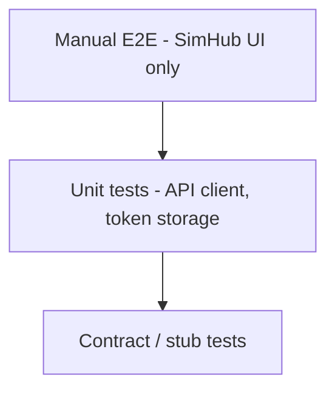

# TP-SPOC-005: POC Testing and Completion

**Doc type**: Technical Plan | **ID**: TP-SPOC-005 | **Implements**: [PRD-001: SimHub Plugin POC](../../product/simhub-plugin-poc/001-simhub-plugin-poc.md) | **Related**: [SimHub Plugin LLD](../../design/components/simhub-plugin.md), [API plugin](../../api/plugin.md), [001: Plugin Skeleton](001-plugin-skeleton-sdk-config.md), [002: Auth (PKCE, Token Storage)](002-auth-pkce-token-storage.md), [003: API Client and Heartbeat](003-api-client-heartbeat.md), [004: Minimal SimHub UI](004-minimal-simhub-ui.md), [Development guide](../../guides/development.md), [Next steps](../../architecture/next-steps.md)

**Status**: Draft  
**Version**: 1.0  
**Date**: 2026-02-01  
**Owner**: Development Team

## Overview

This Technical Plan defines the testing and POC completion criteria for the SimHub Plugin POC (NFR-003). POC is done when manual E2E passes and a minimum set of automated tests gives regression coverage on the plugin–API contract. No requirement for full SimHub-in-CI for POC.

## Architecture

### Test Pyramid (POC Minimum)

- **Manual E2E**: One full run from SimHub UI (build → install in SimHub → plugin appears in UI → Link to Discord → Send heartbeat → see status). Documented in development guide or next-steps.
- **Automated**: Unit tests for API client (token exchange, heartbeat) against mock or stub so request/response contract is regression-tested; optionally unit tests for token storage (round-trip with DPAPI or mock). Integration test against real local Worker is optional for POC.

## Implementation Details

### Manual E2E

- **Steps**: (1) Build plugin DLL. (2) Install in SimHub (copy to SimHub install folder or Plugins; see `scripts/deploy-plugin.ps1`). (3) Restart SimHub; confirm plugin appears in plugin list/settings. (4) **Select WinPodiums in the enabled feature menu on the left**; confirm settings panel shows “Link to Discord”, status “Not linked”, API URL, manual token, Send heartbeat, Log out. (5) Click “Link to Discord” (or paste manual token); complete Discord auth; confirm “Linked” in plugin. (6) Click “Send heartbeat”; confirm “Heartbeat OK” (or documented failure if API unavailable). (7) Optionally set API base URL to local (e.g. localhost:8787) and repeat 5–6 against local API.
- **Documentation**: Record these steps in [Development guide](../../guides/development.md) or [Next steps](../../architecture/next-steps.md) so any developer can run manual E2E and confirm POC completion.

### Automated Tests (Minimum)

- **API client – token exchange**: Mock or stub `POST /api/auth/token-exchange` (and optionally `POST /api/auth/discord/exchange`). Assert request URL, method, body shape (e.g. `token` or `code`, `code_verifier`, `redirect_uri`); assert response parsing (access_token, discord_id or equivalent). Protects against contract drift.
- **API client – heartbeat**: Mock or stub `POST /api/plugin/heartbeat`. Assert request URL, method, Authorization header (Bearer), body shape (e.g. `version`); assert 200 success and 401/400 failure handling. Protects against contract drift.
- **Token storage** (optional): Unit test Save → Load round-trip (real DPAPI on dev machine or mock that stores in memory); Clear removes data. Ensures storage logic does not regress.

### CI / Pre-push

- Run automated unit/contract tests in CI or pre-push where applicable (e.g. existing repo CI). No requirement to run SimHub or full plugin load in CI for POC.

### Out of Scope for POC

- Full SimHub-in-CI (plugin load inside SimHub in CI).
- End-to-end integration test against production API (optional; local Worker is sufficient for POC).
- Performance or load testing.

## Testing Strategy

- **Manual E2E**: As above; at least one successful full run documented.
- **Unit**: API client methods (TokenExchangeAsync, HeartbeatAsync) with mocked HTTP; token storage Save/Load/Clear.
- **Contract**: Request/response shapes match OpenAPI (or documented API spec) for exchange and heartbeat.

## Deployment

- No deployment steps; tests run in dev and CI. Document how to run tests (e.g. `dotnet test` or repo test command) in README or development guide.

## Performance Considerations

- Tests should complete in seconds (unit/contract); manual E2E in minutes. No performance targets for POC tests.

## Security Considerations

- Tests must not use real secrets or commit tokens. Use mocks, stubs, or test-only tokens that are not committed.
- DPAPI tests on dev machine use current user; CI may skip DPAPI tests or use mock if no user context.

## Dependencies

- **Internal**: [001](001-plugin-skeleton-sdk-config.md)–[004](004-minimal-simhub-ui.md) implemented so that API client, auth, and UI exist to test.
- **Test framework**: Use existing repo test stack (e.g. xUnit, NUnit, MSTest) for .NET plugin tests.

## Risks & Mitigations

| Risk | Mitigation |
|------|------------|
| Manual E2E not repeatable | Document steps and environment (SimHub version, API base URL) in dev guide or next-steps. |
| Contract drift | Automated contract/stub tests; align with OpenAPI. |

## Success Criteria

- **Manual E2E**: At least one full run from SimHub UI only (build → install → plugin in UI → Link to Discord → Send heartbeat → see status) is documented and repeatable.
- **Automated**: Unit tests for API client (token exchange, heartbeat) against mock/stub; request/response contract regression-covered. Optionally unit tests for token storage.
- **CI/pre-push**: Tests run where applicable; no requirement for SimHub-in-CI for POC.
- **POC complete**: Manual E2E passes and minimum automated tests are in place and green.

## Related Documentation

- [PRD-001: SimHub Plugin POC](../../product/simhub-plugin-poc/001-simhub-plugin-poc.md)
- [SimHub Plugin LLD](../../design/components/simhub-plugin.md)
- [API plugin](../../api/plugin.md)
- [001: Plugin Skeleton](001-plugin-skeleton-sdk-config.md)
- [002: Auth (PKCE, Token Storage)](002-auth-pkce-token-storage.md)
- [003: API Client and Heartbeat](003-api-client-heartbeat.md)
- [004: Minimal SimHub UI](004-minimal-simhub-ui.md)
- [Development guide](../../guides/development.md)
- [Next steps](../../architecture/next-steps.md)
- [Documentation Standards](../../standards/documentation-standards.md)
