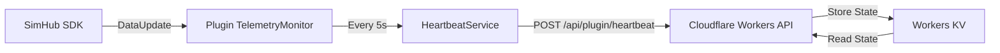

# TP-001: Telemetry Heartbeat System

**Doc type**: Tech Plan | **ID**: TP-001 | **Implements**: [PRD-001: Telemetry Heartbeat System](../../product/telemetry-proof-system/001-heartbeat-system.md) | **Related**: [API Specification](../../api/plugin.md#heartbeat-endpoint), [SimHub Plugin LLD](../../design/components/simhub-plugin.md)

**Status**: Draft  
**Version**: 1.0  
**Date**: 2026-01-31  
**Owner**: Development Team  
**Implements**: [PRD-001: Telemetry Heartbeat System](../../product/telemetry-proof-system/001-heartbeat-system.md)  
**Related**: [API Specification](../../api/plugin.md#heartbeat-endpoint), [SimHub Plugin LLD](../../design/components/simhub-plugin.md)

## Overview

This Technical Plan implements the Telemetry Heartbeat System, which sends continuous heartbeats from the SimHub plugin to the API server, proving an active SimHub connection. The implementation includes plugin-side heartbeat transmission and server-side heartbeat storage.

## Architecture

### Component Diagram



### Data Flow

1. SimHub calls `DataUpdate()` callback in plugin
2. Plugin `TelemetryMonitor` detects SimHub is active
3. `HeartbeatService` collects current telemetry values
4. Plugin sends heartbeat payload to `/api/plugin/heartbeat`
5. API validates authentication token
6. API stores heartbeat state in Workers KV
7. API returns 200 OK with session ID

## Implementation Details

### API Endpoints

#### POST /api/plugin/heartbeat

**Description**: Receive heartbeat from plugin with live SimHub telemetry

**Request Headers**:
```
Authorization: Bearer {discord_oauth_token}
Content-Type: application/json
```

**Request Body**:
```typescript
interface HeartbeatPayload {
  discordId: string;
  timestamp: string; // ISO 8601 UTC
  currentSpeed: number; // km/h
  currentRPM: number;
  currentGear: number;
  currentLapTime: number; // seconds
  currentPosition: number;
  sessionTime: number; // seconds since session start
  telemetryHash: string; // SHA256 hash of telemetry state
}
```

**Response (200 OK)**:
```typescript
interface HeartbeatResponse {
  success: true;
  sessionId: string; // UUID v4
  timestamp: string; // Server timestamp
}
```

**Response (400 Bad Request)**:
```typescript
interface ErrorResponse {
  success: false;
  error: string; // Error message
  code: string; // Error code
}
```

**Response (401 Unauthorized)**:
```typescript
interface ErrorResponse {
  success: false;
  error: "Invalid or expired token";
  code: "UNAUTHORIZED";
}
```

### Data Models

#### Plugin-Side: HeartbeatService

```csharp
public class HeartbeatService
{
    private readonly HttpClient _httpClient;
    private readonly TokenStorage _tokenStorage;
    private Timer _heartbeatTimer;
    private bool _isActive;
    
    public void StartHeartbeat()
    {
        _isActive = true;
        _heartbeatTimer = new Timer(async _ => await SendHeartbeat(), null, 0, 5000);
    }
    
    public void StopHeartbeat()
    {
        _isActive = false;
        _heartbeatTimer?.Dispose();
    }
    
    private async Task SendHeartbeat()
    {
        if (!_isActive) return;
        
        try
        {
            var telemetry = GetCurrentTelemetry();
            var payload = new HeartbeatPayload
            {
                DiscordId = _tokenStorage.GetDiscordId(),
                Timestamp = DateTime.UtcNow.ToString("O"),
                CurrentSpeed = telemetry.Speed,
                CurrentRPM = telemetry.RPM,
                CurrentGear = telemetry.Gear,
                CurrentLapTime = telemetry.LapTime,
                CurrentPosition = telemetry.Position,
                SessionTime = telemetry.SessionTime,
                TelemetryHash = ComputeTelemetryHash(telemetry)
            };
            
            var token = await _tokenStorage.GetAccessTokenAsync();
            var request = new HttpRequestMessage(HttpMethod.Post, "https://winpodiums.com/api/plugin/heartbeat")
            {
                Headers = { Authorization = new AuthenticationHeaderValue("Bearer", token) },
                Content = new StringContent(JsonConvert.SerializeObject(payload), Encoding.UTF8, "application/json")
            };
            
            var response = await _httpClient.SendAsync(request);
            if (!response.IsSuccessStatusCode)
            {
                LogError($"Heartbeat failed: {response.StatusCode}");
                // Retry logic (exponential backoff)
            }
        }
        catch (Exception ex)
        {
            LogError($"Heartbeat error: {ex.Message}");
            // Don't crash plugin, just log
        }
    }
    
    private GameData GetCurrentTelemetry()
    {
        // Get from SimHub SDK GameData object
        return _pluginManager.GameData;
    }
    
    private string ComputeTelemetryHash(GameData telemetry)
    {
        var data = $"{telemetry.Speed}|{telemetry.RPM}|{telemetry.Gear}|{telemetry.Position}|{telemetry.SessionTime}";
        using (var sha256 = SHA256.Create())
        {
            var hash = sha256.ComputeHash(Encoding.UTF8.GetBytes(data));
            return Convert.ToBase64String(hash);
        }
    }
}
```

#### Server-Side: Heartbeat State Storage

```typescript
interface HeartbeatState {
  userId: string;
  lastHeartbeat: number; // Unix timestamp (ms)
  telemetrySequence: TelemetrySnapshot[]; // Last 10 heartbeats
  sessionId: string; // UUID v4
  isActive: boolean;
}

interface TelemetrySnapshot {
  timestamp: number; // Unix timestamp (ms)
  currentSpeed: number;
  currentRPM: number;
  currentGear: number;
  currentLapTime: number;
  currentPosition: number;
  telemetryHash: string;
}

// Workers KV key: `heartbeat:{discordId}`
// TTL: 300 seconds (5 minutes)
```

### Algorithms

#### Heartbeat Processing Algorithm

```typescript
async function processHeartbeat(payload: HeartbeatPayload, env: Env): Promise<HeartbeatResponse> {
  // 1. Validate authentication token
  const userId = await validateToken(payload.discordId, env);
  if (!userId) {
    return { success: false, error: "Invalid token", code: "UNAUTHORIZED" };
  }
  
  // 2. Get existing heartbeat state
  const key = `heartbeat:${payload.discordId}`;
  const existing = await env.KV.get(key);
  const state: HeartbeatState = existing ? JSON.parse(existing) : null;
  
  // 3. Generate session ID if new
  const sessionId = state?.sessionId || generateUUID();
  
  // 4. Create telemetry snapshot
  const snapshot: TelemetrySnapshot = {
    timestamp: Date.now(),
    currentSpeed: payload.currentSpeed,
    currentRPM: payload.currentRPM,
    currentGear: payload.currentGear,
    currentLapTime: payload.currentLapTime,
    currentPosition: payload.currentPosition,
    telemetryHash: payload.telemetryHash
  };
  
  // 5. Update telemetry sequence (FIFO, keep last 10)
  const sequence = state?.telemetrySequence || [];
  sequence.push(snapshot);
  if (sequence.length > 10) {
    sequence.shift(); // Remove oldest
  }
  
  // 6. Update heartbeat state
  const newState: HeartbeatState = {
    userId: payload.discordId,
    lastHeartbeat: Date.now(),
    telemetrySequence: sequence,
    sessionId: sessionId,
    isActive: true
  };
  
  // 7. Store in KV with TTL
  await env.KV.put(key, JSON.stringify(newState), { expirationTtl: 300 });
  
  // 8. Return success
  return {
    success: true,
    sessionId: sessionId,
    timestamp: new Date().toISOString()
  };
}
```

### Error Handling

#### Plugin-Side Error Handling

```csharp
private async Task SendHeartbeat()
{
    try
    {
        // ... heartbeat logic ...
    }
    catch (HttpRequestException ex)
    {
        // Network error - retry with exponential backoff
        await RetryWithBackoff(() => SendHeartbeat(), maxRetries: 3);
    }
    catch (Exception ex)
    {
        // Unexpected error - log but don't crash
        LogError($"Heartbeat error: {ex.Message}");
        // Continue plugin operation
    }
}
```

#### Server-Side Error Handling

```typescript
async function processHeartbeat(payload: HeartbeatPayload, env: Env): Promise<HeartbeatResponse> {
  try {
    // ... processing logic ...
  } catch (error) {
    // Log error but don't expose internal details
    console.error(`Heartbeat processing error: ${error.message}`);
    return {
      success: false,
      error: "Internal server error",
      code: "INTERNAL_ERROR"
    };
  }
}
```

## Testing Strategy

### Unit Tests

#### Plugin-Side Tests

```csharp
[Test]
public void HeartbeatService_SendsHeartbeat_WhenSimHubActive()
{
    // Arrange
    var service = new HeartbeatService(...);
    var mockHttpClient = new MockHttpClient();
    
    // Act
    service.StartHeartbeat();
    await Task.Delay(6000); // Wait for heartbeat
    
    // Assert
    Assert.That(mockHttpClient.Requests.Count, Is.EqualTo(1));
    Assert.That(mockHttpClient.Requests[0].Method, Is.EqualTo(HttpMethod.Post));
}

[Test]
public void HeartbeatService_IncludesTelemetryHash_InPayload()
{
    // Arrange
    var service = new HeartbeatService(...);
    var telemetry = new GameData { Speed = 100, RPM = 5000, Gear = 4 };
    
    // Act
    var hash = service.ComputeTelemetryHash(telemetry);
    
    // Assert
    Assert.That(hash, Is.Not.Null);
    Assert.That(hash.Length, Is.GreaterThan(0));
}
```

#### Server-Side Tests

```typescript
describe('processHeartbeat', () => {
  it('should store heartbeat state in KV', async () => {
    const payload = createMockHeartbeatPayload();
    const env = createMockEnv();
    
    await processHeartbeat(payload, env);
    
    const stored = await env.KV.get(`heartbeat:${payload.discordId}`);
    expect(stored).toBeTruthy();
    const state = JSON.parse(stored);
    expect(state.lastHeartbeat).toBeCloseTo(Date.now(), -3); // Within 1 second
  });
  
  it('should maintain telemetry sequence (last 10)', async () => {
    const payload = createMockHeartbeatPayload();
    const env = createMockEnv();
    
    // Send 15 heartbeats
    for (let i = 0; i < 15; i++) {
      await processHeartbeat({ ...payload, currentSpeed: i }, env);
    }
    
    const stored = await env.KV.get(`heartbeat:${payload.discordId}`);
    const state = JSON.parse(stored);
    expect(state.telemetrySequence.length).toBe(10);
  });
});
```

### Integration Tests

```typescript
describe('Heartbeat Integration', () => {
  it('should handle heartbeat flow end-to-end', async () => {
    // 1. Plugin sends heartbeat
    const response = await fetch('/api/plugin/heartbeat', {
      method: 'POST',
      headers: {
        'Authorization': `Bearer ${validToken}`,
        'Content-Type': 'application/json'
      },
      body: JSON.stringify(mockHeartbeatPayload)
    });
    
    // 2. Verify response
    expect(response.status).toBe(200);
    const data = await response.json();
    expect(data.success).toBe(true);
    expect(data.sessionId).toBeTruthy();
    
    // 3. Verify state stored
    const state = await env.KV.get(`heartbeat:${mockHeartbeatPayload.discordId}`);
    expect(state).toBeTruthy();
  });
});
```

## Deployment

### Plugin Deployment

1. **Build**: Compile plugin DLL
2. **Sign**: Code sign plugin (application attestation)
3. **Package**: Create installer with version number
4. **Upload**: Upload to R2 storage
5. **Update**: Update plugin version in database

### API Deployment

1. **Build**: TypeScript compilation
2. **Test**: Run unit and integration tests
3. **Deploy**: Deploy to Cloudflare Workers via Wrangler
4. **Verify**: Test heartbeat endpoint in production
5. **Monitor**: Monitor heartbeat success rate

### Configuration

#### Plugin Configuration

```json
{
  "heartbeat": {
    "interval": 5000,
    "endpoint": "https://winpodiums.com/api/plugin/heartbeat",
    "retryAttempts": 3,
    "retryBackoff": 1000
  }
}
```

#### Server Configuration

```typescript
// wrangler.toml
[[kv_namespaces]]
binding = "KV"
id = "heartbeat-kv-namespace"

// Environment variables
HEARTBEAT_TTL = 300 // 5 minutes
```

## Performance Considerations

### Optimization Strategies

1. **KV Batching**: Batch KV operations where possible
2. **Async Processing**: Don't block heartbeat processing
3. **Caching**: Cache authentication token validation
4. **Compression**: Compress heartbeat payloads (future)

### Performance Targets

- **Heartbeat Transmission**: <10ms (plugin-side)
- **Heartbeat Processing**: <50ms (server-side, p95)
- **KV Read/Write**: <20ms (p95)
- **Total Latency**: <50ms (p95)

## Security Considerations

### Authentication

- All heartbeats require valid Discord OAuth2 token
- Tokens validated on every heartbeat
- Invalid tokens rejected with 401 Unauthorized

### Data Protection

- Heartbeat state stored in Workers KV (encrypted at rest)
- Telemetry hash prevents tampering
- Session IDs are UUID v4 (cryptographically random)

### Rate Limiting

- Maximum 1 heartbeat per 3 seconds (prevents spam)
- Rate limiting enforced server-side
- Exceeding rate limit returns 429 Too Many Requests

## Dependencies

### External Dependencies

- **SimHub SDK**: For telemetry access
- **Discord OAuth2**: For authentication
- **Cloudflare Workers KV**: For state storage
- **HTTP Client**: For API communication

### Internal Dependencies

- Token storage system (DPAPI)
- Plugin configuration system
- Error logging system

## Risks & Mitigations

| Risk | Mitigation |
|------|------------|
| Network failures | Retry logic with exponential backoff |
| KV failures | Fallback to D1 (slower but works) |
| Token expiration | Automatic token refresh |
| SimHub SDK changes | Version pinning, compatibility testing |

## Success Criteria

- ✅ Heartbeat success rate >99%
- ✅ Heartbeat latency <50ms (p95)
- ✅ Zero false positives (legitimate users never blocked)
- ✅ Heartbeat state stored correctly in KV
- ✅ Telemetry sequence maintained (last 10)

## Related Documentation

- [PRD-001: Telemetry Heartbeat System](../../product/telemetry-proof-system/001-heartbeat-system.md)
- [API Specification](../../api/plugin.md#heartbeat-endpoint)
- [SimHub Plugin LLD](../../design/components/simhub-plugin.md)
- [Documentation Standards](../../standards/documentation-standards.md)
