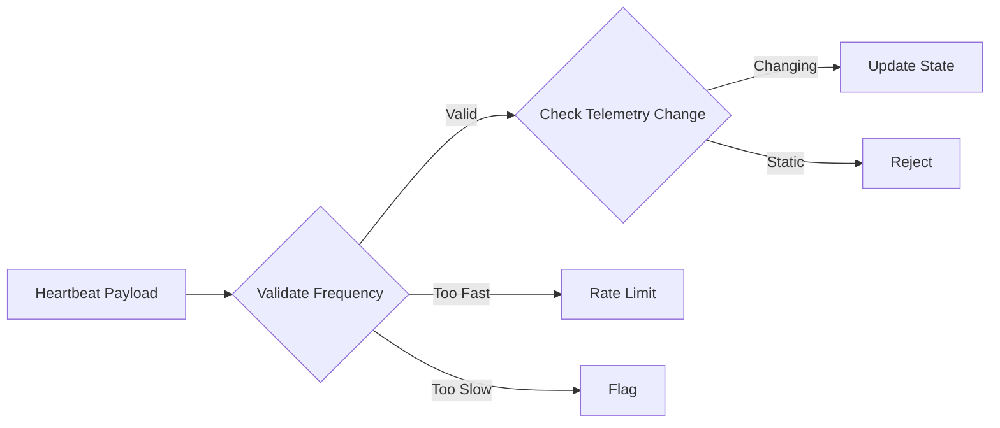

# Technical Plan: Heartbeat Validation

**Status**: Draft  
**Version**: 1.0  
**Date**: 2026-01-31  
**Owner**: Development Team  
**Implements**: [PRD-002: Heartbeat Validation](../../product/telemetry-proof-system/002-heartbeat-validation.md)  
**Related**: [TP-001: Heartbeat System](001-heartbeat-system.md), [API Specification](../../api/plugin.md#heartbeat-validation)

## Overview

This Technical Plan implements server-side heartbeat validation that verifies heartbeats contain live, changing telemetry data and arrive at expected intervals. This ensures heartbeats prove an active SimHub connection.

## Architecture

### Validation Flow



## Implementation Details

### Validation Algorithm

```typescript
async function validateHeartbeat(
  payload: HeartbeatPayload,
  existingState: HeartbeatState | null,
  env: Env
): Promise<ValidationResult> {
  // 1. Frequency validation
  if (existingState) {
    const timeSinceLastHeartbeat = Date.now() - existingState.lastHeartbeat;
    
    if (timeSinceLastHeartbeat < 3000) {
      return {
        valid: false,
        reason: "Heartbeat too frequent (rate limited)",
        code: "RATE_LIMITED"
      };
    }
    
    if (timeSinceLastHeartbeat > 10000) {
      return {
        valid: false,
        reason: "Heartbeat too slow (connection issue)",
        code: "CONNECTION_STALE"
      };
    }
  }
  
  // 2. Telemetry change detection
  if (existingState && existingState.telemetrySequence.length > 0) {
    const lastSnapshot = existingState.telemetrySequence[
      existingState.telemetrySequence.length - 1
    ];
    
    // Check if telemetry values are identical (static data)
    if (
      Math.abs(payload.currentSpeed - lastSnapshot.currentSpeed) < 0.1 &&
      Math.abs(payload.currentRPM - lastSnapshot.currentRPM) < 1 &&
      payload.currentGear === lastSnapshot.currentGear
    ) {
      return {
        valid: false,
        reason: "Telemetry not changing (static data detected)",
        code: "STATIC_TELEMETRY"
      };
    }
  }
  
  // 3. Validation passed
  return { valid: true };
}
```

### Error Responses

```typescript
// 400 Bad Request - Invalid heartbeat
{
  success: false,
  error: "Telemetry not changing (static data detected)",
  code: "STATIC_TELEMETRY"
}

// 429 Too Many Requests - Rate limited
{
  success: false,
  error: "Heartbeat too frequent (rate limited)",
  code: "RATE_LIMITED"
}
```

## Testing Strategy

### Unit Tests

```typescript
describe('validateHeartbeat', () => {
  it('should reject heartbeats arriving too fast', async () => {
    const state = createStateWithRecentHeartbeat(1000); // 1 second ago
    const result = await validateHeartbeat(payload, state, env);
    expect(result.valid).toBe(false);
    expect(result.code).toBe("RATE_LIMITED");
  });
  
  it('should detect static telemetry', async () => {
    const state = createStateWithStaticTelemetry();
    const result = await validateHeartbeat(staticPayload, state, env);
    expect(result.valid).toBe(false);
    expect(result.code).toBe("STATIC_TELEMETRY");
  });
});
```

## Related Documentation

- [PRD-002: Heartbeat Validation](../../product/telemetry-proof-system/002-heartbeat-validation.md)
- [TP-001: Heartbeat System](001-heartbeat-system.md)
- [Documentation Standards](../../standards/documentation-standards.md)
